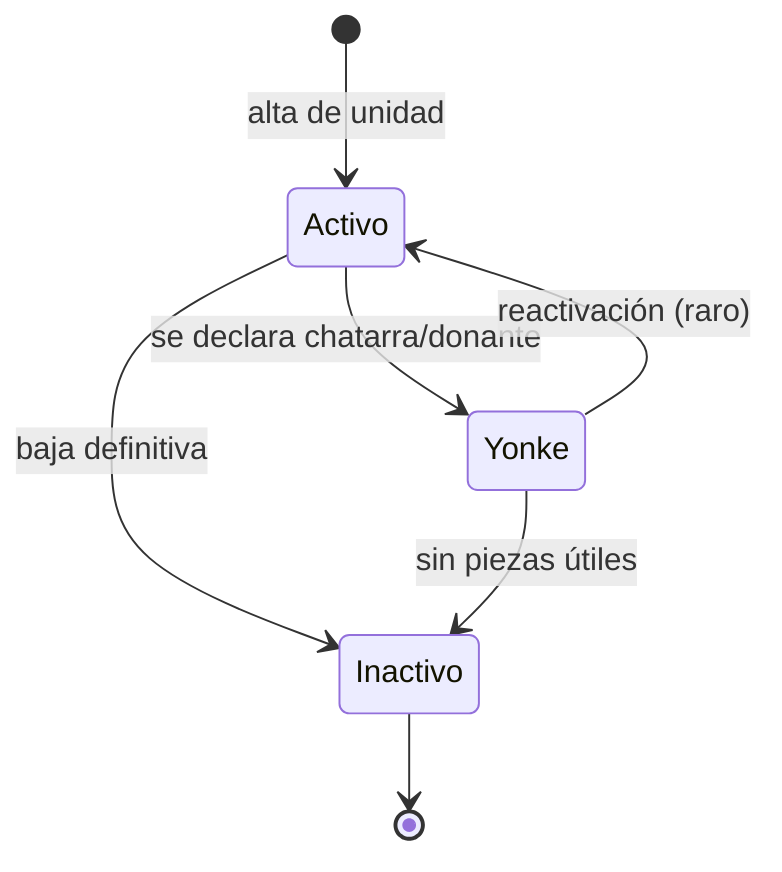
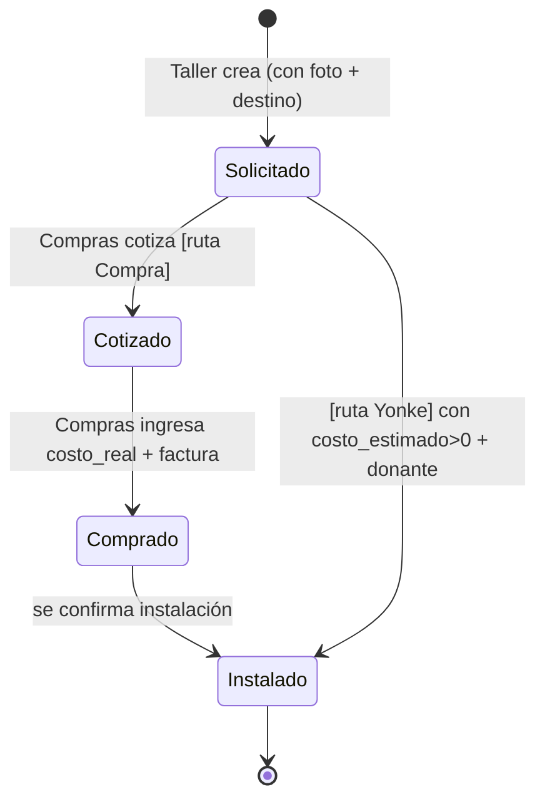
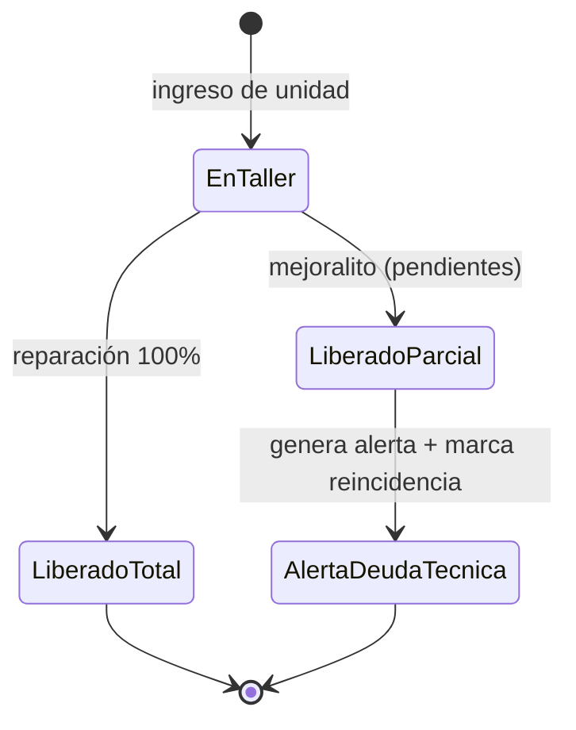

# 01 — Especificación de Requisitos de Software (SRS)
## Warhorse — Hub Consolidador de Gastos por Tracto

| | |
|---|---|
| **Proyecto** | Warhorse (Hub Consolidador de Gastos por Tracto) |
| **Organización** | WarHorse México · Dataholics |
| **Documento** | 01 — SRS |
| **Versión** | 2.0 |
| **Fecha** | 7 de julio de 2026 |
| **Estándar** | ISO/IEC/IEEE 29148:2018 |
| **Autor técnico** | Ingeniería Plan Juárez / Dataholics |
| **Depende de** | [ADR-001](../02-arquitectura/ADR/ADR-001_stack-react-vite-ci4-api.md), [ADR-002](../02-arquitectura/ADR/ADR-002_valorizacion-yonke-cascada.md), [ADR-003](../02-arquitectura/ADR/ADR-003_demo-first-esqueleto-reutilizable.md) |

> *Actualización v2.0: incorpora las decisiones de negocio firmes de la especificación funcional v2.0 (valorización Yonke en cascada, roles finales, diésel en alcance, veredicto configurable) y fija el stack del [ADR-001](../02-arquitectura/ADR/ADR-001_stack-react-vite-ci4-api.md). Los flujos marcados "verificado en demo" fueron ejercitados por el prototipo validado.*

---

## 1. Introducción

### 1.1 Propósito

Este documento especifica, de forma completa y verificable, qué debe hacer Warhorse: sus requisitos funcionales y no funcionales, sus actores, sus máquinas de estado y sus criterios de aceptación. Sirve al equipo de desarrollo como fuente de verdad del comportamiento del sistema y a Dirección/Comercial como contrato de alcance del MVP. Garantiza que cada requisito sea trazable a una fuente primaria (§ trazabilidad en el doc funcional) y a un caso de prueba (doc [06](../06-pruebas/06_plan_de_pruebas.md)).

### 1.2 Alcance del MVP

El MVP consolida, por unidad de la flota, el gasto de **diésel + refacciones + taller** bajo la llave `id_unidad`, y expone un **veredicto de rentabilidad** (mantener / evaluar / vender) sustentado en la evidencia (histórico de reparaciones y piezas). Cubre de extremo a extremo:

- Autenticación y sesión con RBAC de cuatro roles.
- Catálogo maestro de unidades (fuente única de la flota) con `valor_referencia`.
- Captura de consumo de diésel por unidad.
- Requisición de refacciones con dos orígenes (Compra / Yonke) y foto obligatoria.
- Gestión del ciclo de compra por parte de Compras.
- Registro de ingreso/diagnóstico/liberación de taller, incluida la liberación parcial ("mejoralito") y su alerta de deuda técnica.
- Dashboard directivo con consolidado, eficiencia, análisis de mantenimiento y veredicto configurable.
- Ficha de tracto con la evidencia navegable.
- Administración de usuarios y permisos.

**Explícitamente fuera del MVP:**

- Contabilidad de cuentas por pagar, conciliaciones bancarias.
- Nómina y control de horas extra de mecánicos.
- Kanban en tiempo real de mecánicos / asignación de tareas en piso.
- Reportes fotográficos de facturación para clientes externos de ruta (Sunrise, Durabox).
- OCR de la Hoja Blanca (se contempla como backlog post-MVP, no se implementa).
- Regla contable formal de valorización de Yonke (se usa la cascada del [ADR-002](../02-arquitectura/ADR/ADR-002_valorizacion-yonke-cascada.md) como regla de trabajo).

### 1.3 Definiciones, acrónimos y abreviaturas

| Término | Definición |
|---|---|
| **Tracto / Unidad** | Activo físico de la flota (tractor, caja o thermo). Entidad ancla identificada por `id_unidad` (ej. WH125). |
| **Yonke** | Unidad dada de baja operativa que sirve como **donante de piezas** (ej. WH03, WH60). |
| **Canibalización** | Extraer una pieza de una unidad Yonke para instalarla en una unidad activa. |
| **Requisición** | Solicitud de una refacción; puede ser de origen Compra o Yonke. |
| **Mejoralito** | Liberación parcial: la unidad sale de taller con fallas pendientes; genera deuda técnica. |
| **Deuda técnica (operativa)** | Fallas no resueltas registradas al liberar parcialmente una unidad; predicen reincidencia. |
| **Costo Real Acumulado** | Suma por unidad de diésel + refacciones + taller. |
| **Valor de referencia** | Valor financiero del activo capturado por Dirección; base del veredicto. |
| **Veredicto** | Sugerencia por unidad: Mantener / Evaluar / Vender. |
| **RBAC** | Control de acceso basado en roles. |
| **`origen_costo_estimado`** | Cómo se obtuvo el costo de una pieza Yonke: `ultima_compra` / `catalogo` / `manual`. |
| **PII** | Información personal identificable. |
| **LFPDPPP** | Ley Federal de Protección de Datos Personales en Posesión de los Particulares (México). |

### 1.4 Stack tecnológico de referencia

| Capa | Tecnología | Versión |
|---|---|---|
| Frontend SPA | React + TypeScript + Vite | 19 / 5 / 6 |
| Estilos | Tailwind CSS | 4 |
| Backend API | CodeIgniter 4 (PHP) | 4.7 / 8.2+ |
| Base de datos | MySQL | 8.0 |
| Auth | CI4 Shield (token de acceso + sesión) | — |

> Nota: el stack cambió respecto a los archivos FRAGA (HTML+Alpine monolítico). Ver [ADR-001](../02-arquitectura/ADR/ADR-001_stack-react-vite-ci4-api.md).

---

## 2. Descripción general

### 2.1 Perspectiva del producto

Warhorse es una SPA React (canal de presentación) sobre una API REST de CodeIgniter 4 (lógica y autorización) con MySQL (**fuente de verdad**). El frontend nunca decide reglas de seguridad ni cálculos de rentabilidad; consume endpoints que el backend calcula. La frontera entre las dos partes es el contrato HTTP/JSON del doc [05](../05-api/05_especificacion_api.md), congelado por el demo validado.

### 2.2 Roles de usuario

| Rol | Persona de referencia | Privilegios clave | Restricciones |
|---|---|---|---|
| **Taller** | Edgar Fraga / Kevin Ávila (comparten rol) | Crea requisiciones, registra canibalización Yonke, registra ingreso/diagnóstico/liberación de unidades, consolida fotos. Ve Requisición y Catálogo. | No aprueba compras ni ingresa costos reales de compra; no ve el Dashboard directivo. |
| **Compras** | Montzay Vázquez | Ve todas las requisiciones, gestiona su ciclo de estado, ingresa costo real y factura. Ve Compras y Catálogo. | No captura diagnósticos ni libera unidades; no ve Dashboard. |
| **Diésel** | Greisy | Captura registros de consumo de diésel (litros, costo, km) por unidad. | Solo su módulo. |
| **Dirección (Admin)** | — | Solo lectura sobre transacciones; consume el Dashboard, gestiona catálogos maestros (alta/baja/estado de unidades, `valor_referencia`), administra usuarios/permisos y ajusta parámetros del veredicto. | No captura transacciones operativas. |

Un usuario tiene **un** rol técnico. El Administrador de Taller y su Auxiliar comparten el rol "Taller" (`✔ decisión firme`), lo que evita que el trabajo se embotelle en una sola persona. La navegación visible por rol se define por una matriz de permisos (ver RF-USR-03).

### 2.3 Suposiciones y dependencias

- Existe conectividad móvil en el piso del taller para enviar requisiciones (riesgo de adopción documentado, §RNF y doc 09).
- El `valor_referencia` de cada unidad lo captura Dirección; sin él, el veredicto de esa unidad muestra "pendiente" en vez de una sugerencia falsa.
- El módulo Diésel depende de captura disciplinada para que el KPI de eficiencia sea real.
- El almacenamiento de fotos vive fuera del webroot en el VPS.
- El demo UI/UX ya está validado; la API se implementa contra su contrato.

---

## 3. Requisitos funcionales

Formato: `RF-[MÓDULO]-[n]`. Criterio de aceptación verificable en cada uno.

### 3.1 Autenticación y sesión (AUTH)

**RF-AUTH-01** — Inicio de sesión
El sistema autentica a un usuario por correo y contraseña contra la base de usuarios, emite un token de acceso y establece la sesión con el rol del usuario resuelto en servidor.
**Criterio de aceptación:** con credenciales válidas se recibe un token y el usuario es dirigido a su vista de aterrizaje por rol (Taller→Requisición, Compras→Compras, Dirección→Dashboard); con credenciales inválidas se recibe error 401 sin revelar si el fallo fue usuario o contraseña.

**RF-AUTH-02** — Aterrizaje por rol
Tras autenticarse, el usuario aterriza en la vista principal de su rol.
**Criterio de aceptación:** Taller aterriza en Requisición, Compras en Panel de Compras, Dirección en Dashboard. *(Verificado en demo.)*

**RF-AUTH-03** — Cierre de sesión y expiración
El sistema revoca el token al cerrar sesión y rechaza tokens expirados o revocados.
**Criterio de aceptación:** tras logout, cualquier petición con el token anterior recibe 401.

**RF-AUTH-04** — Recorrido guiado inicial (onboarding)
En el primer ingreso, el sistema ofrece un tour de ~1 minuto que explica los módulos; es saltable y repetible desde el menú.
**Criterio de aceptación:** el tour aparece solo la primera vez (persistido localmente), puede saltarse en cualquier paso y relanzarse con el botón "Tutorial". *(Verificado en demo.)*

### 3.2 Catálogo de unidades (UNI)

**RF-UNI-01** — Fuente única de la flota
El sistema mantiene un catálogo maestro de unidades; todos los selectores de unidad de todos los módulos leen de este catálogo vivo.
**Criterio de aceptación:** al dar de alta o cambiar el estado de una unidad, el cambio se refleja de inmediato en los selectores de Diésel, Requisición y Compras.

**RF-UNI-02** — Alta/edición de unidad (solo Dirección)
Dirección da de alta una unidad con `id_unidad`, `tipo` (Tractor/Caja/Thermo), `estado` (Activo/Yonke/Inactivo), `fecha_alta` y `valor_referencia`.
**Criterio de aceptación:** un `id_unidad` duplicado es rechazado; el `valor_referencia` acepta solo numérico.

**RF-UNI-03** — Cambio de estado de unidad (solo Dirección)
Dirección cambia el estado de una unidad respetando la máquina de estados (§4.1).
**Criterio de aceptación:** una unidad marcada Yonke queda disponible como donante en el formulario de requisición; una Inactiva desaparece de los selectores pero conserva su historial.

**RF-UNI-04** — Filtrado del catálogo
El usuario filtra el catálogo por estado (Todos/Activo/Yonke/Inactivo).
**Criterio de aceptación:** el filtro "Yonke" permite ver de inmediato cuántas unidades donantes hay disponibles. *(Verificado en demo.)*

**RF-UNI-05** — Navegación a la ficha
Cada unidad del catálogo es navegable a su Ficha de Tracto (§3.7).
**Criterio de aceptación:** un clic en una unidad abre su ficha con el detalle correcto.

### 3.3 Módulo Diésel (DIE)

**RF-DIE-01** — Captura de carga de diésel (rol Diésel)
El sistema registra una carga con `unidad_id` (obligatorio, validado contra catálogo), `fecha`, `litros`, `costo_total`, `km_recorridos` y `foto_ticket_url` (opcional).
**Criterio de aceptación:** un registro sin unidad válida es rechazado (no hay transacción huérfana, RF-INT-01).

**RF-DIE-02** — Validación numérica estricta
Los campos `litros`, `costo_total` y `km_recorridos` aceptan solo numéricos.
**Criterio de aceptación:** texto en un campo de costo es rechazado en captura, eliminando los descuadres del vaciado manual.

**RF-DIE-03** — Aporte al consolidado
Cada carga suma de inmediato al término "Diésel" del Costo Real Acumulado de su unidad.
**Criterio de aceptación:** el KPI de diésel del Dashboard y la ficha de la unidad reflejan la nueva carga.

### 3.4 Requisición de refacciones (REQ)

**RF-REQ-01** — Creación de requisición (rol Taller)
El sistema crea una requisición con `unidad_destino_id` (obligatorio), `origen` (Compra/Yonke), `descripcion_pieza`, `numero_parte` (opcional), `foto_pieza_url` (**obligatoria**), `urgencia` (Rápida/Media/Crítica) y, según origen, los campos de costo.
**Criterio de aceptación:** sin unidad destino, sin descripción o sin foto, la requisición no se crea y se muestra el error específico. *(Verificado en demo.)*

**RF-REQ-02** — Origen Yonke obliga donante
Si `origen = Yonke`, el sistema obliga a seleccionar `unidad_donante_id` de entre unidades con estado Yonke.
**Criterio de aceptación:** Yonke sin donante muestra "El origen Yonke obliga a registrar la unidad donante" y no permite enviar. *(Verificado en demo.)*

**RF-REQ-03** — Costo estimado Yonke (cascada)
Para `origen = Yonke`, el backend asigna `costo_estimado` por la cascada del [ADR-002](../02-arquitectura/ADR/ADR-002_valorizacion-yonke-cascada.md) (última compra → catálogo → manual), nunca $0, y registra `origen_costo_estimado`.
**Criterio de aceptación:** si A y C fallan, el sistema exige captura manual > 0 y la marca como `manual`; una requisición Yonke jamás queda en $0. *(Verificado en demo: se exige costo > 0.)*

**RF-REQ-04** — Foto obligatoria
Ninguna requisición se crea sin `foto_pieza_url`.
**Criterio de aceptación:** intentar enviar sin foto muestra "La foto de la pieza o número de serie es obligatoria". *(Verificado en demo.)*

**RF-REQ-05** — Formulario dinámico por origen
La UI cambia según el origen: Compra pide descripción/costo (costo puede quedar pendiente para Compras); Yonke exige donante y costo estimado.
**Criterio de aceptación:** alternar el toggle Compra↔Yonke muestra/oculta los campos correctos. *(Verificado en demo.)*

**RF-REQ-06** — Notificación a Compras
Al enviarse una requisición, el sistema notifica a Compras de forma asíncrona (cola).
**Criterio de aceptación:** la requisición aparece en el panel de Compras ordenada por urgencia; la respuesta al usuario del taller no espera al envío externo.

**RF-REQ-07** — Envío fuera de horario
El flujo móvil permite enviar una requisición crítica en cualquier momento sin depender de una llamada telefónica.
**Criterio de aceptación:** una requisición crítica creada a las 21:00 se registra y notifica sin intervención manual (caso borde §8).

### 3.5 Panel de Compras (COM)

**RF-COM-01** — Listado priorizado
Compras ve todas las requisiciones ordenadas por urgencia (Crítica → Media → Rápida) y filtrables por estado.
**Criterio de aceptación:** el filtro por estado y el orden por urgencia funcionan. *(Verificado en demo.)*

**RF-COM-02** — Avance de ciclo (Compra)
Compras avanza una requisición de Compra por Solicitado → Cotizado → Comprado → Instalado, ingresando `costo_real` y `numero_factura` entre Cotizado y Comprado.
**Criterio de aceptación:** una requisición de Compra no puede llegar a Instalado sin `costo_real` (o marca explícita de pendiente); ver §4.2.

**RF-COM-03** — Avance de ciclo (Yonke)
Una requisición Yonke puede saltar de Solicitado directo a Instalado, pero debe llevar `costo_estimado` > 0 y `unidad_donante_id`.
**Criterio de aceptación:** el sistema pide confirmación de instalación y, al confirmar, vincula el costo estimado al tracto destino. *(Verificado en demo: confirmación de instalación.)*

**RF-COM-04** — Distinción visual origen
El panel distingue visualmente requisiciones de Compra y de Yonke.
**Criterio de aceptación:** cada fila muestra un badge de origen distinto y el costo Yonke se marca como estimado, no facturado. *(Verificado en demo.)*

### 3.6 Módulo Taller (TAL)

**RF-TAL-01** — Ingreso de unidad
El sistema registra un ingreso con `unidad_id`, `fecha_ingreso`, `diagnostico`, `criticidad` (Rápida/Media/Crítico).
**Criterio de aceptación:** el ingreso queda asociado a la unidad; la criticidad es una expectativa de tiempo, no una fecha fija.

**RF-TAL-02** — Acumulación de costo de taller
Durante la reparación se acumulan `costo_taller` y las requisiciones asociadas.
**Criterio de aceptación:** el costo de taller suma al término "Taller" del consolidado de la unidad.

**RF-TAL-03** — Liberación total o parcial
Al liberar, se marca `tipo_liberacion` Total o Parcial. Si Parcial, se listan `pendientes`.
**Criterio de aceptación:** una liberación parcial exige al menos un pendiente y dispara la alerta de deuda técnica (RF-TAL-04).

**RF-TAL-04** — Alerta de deuda técnica y reincidencia
Una liberación Parcial genera una alerta visible para Operaciones/Dirección y marca la unidad como candidata a reincidencia; si reingresa por la misma falla, se señala "reincidencia".
**Criterio de aceptación:** el reingreso por la misma falla tras un mejoralito se marca como reincidencia en la ficha y en la alerta. *(Verificado en demo: el veredicto pondera % mejoralito.)*

### 3.7 Ficha de Tracto (FIC)

**RF-FIC-01** — Encabezado y KPIs de unidad
La ficha muestra `id_unidad`, estado, costo total acumulado y KPIs (diésel, refacciones, taller, valor de referencia).
**Criterio de aceptación:** los KPIs coinciden con la suma de las transacciones de la unidad. *(Verificado en demo.)*

**RF-FIC-02** — Historial de reparaciones
Lista las reparaciones con fecha, diagnóstico, criticidad (badge), tipo de liberación (badge Total/Parcial), días en taller y costo.
**Criterio de aceptación:** WH125 muestra sus 86 días de reparación de transmisión con el estilo de días largos resaltado. *(Verificado en demo.)*

**RF-FIC-03** — Piezas instaladas
Lista las requisiciones cuyo destino es esta unidad, con origen (badge Compra/Yonke); si Yonke, de qué donante vino y su costo estimado.
**Criterio de aceptación:** una pieza Yonke muestra "donada por WHxx" y su costo como estimado. *(Verificado en demo.)*

**RF-FIC-04** — Vista de unidad Yonke
Si la unidad es Yonke, la ficha cambia de foco y muestra "Piezas donadas a otras unidades" (qué salió, hacia dónde, con qué costo estimado) en lugar de reparaciones.
**Criterio de aceptación:** WH03 muestra sus donaciones con destino y costo. *(Verificado en demo.)*

### 3.8 Dashboard directivo (DASH)

**RF-DASH-01** — Consolidado por tracto
El Dashboard muestra los KPIs consolidados (diésel, refacciones, taller, costo real acumulado) y una gráfica de gasto por tracto con el más costoso resaltado.
**Criterio de aceptación:** la barra del tracto de mayor costo se resalta (rayado naranja) y cada barra es navegable a su análisis. *(Verificado en demo.)*

**RF-DASH-02** — Eficiencia de rendimiento
Muestra un gauge de eficiencia (costo diésel / km) por unidad seleccionada.
**Criterio de aceptación:** el gauge refleja `eficiencia = costo_total_diesel / km` de la unidad; sin datos de diésel el KPI se inhabilita.

**RF-DASH-03** — Análisis de mantenimiento
Muestra un donut de % Reparación Total vs. Mejoralito de la unidad seleccionada, calculado desde reparaciones.
**Criterio de aceptación:** el % coincide con la proporción de liberaciones Totales sobre el total. *(Verificado en demo.)*

**RF-DASH-04** — Veredicto de rentabilidad
Por unidad, el Dashboard emite Mantener / Evaluar / Vender comparando Costo Real Acumulado contra `valor_referencia` dentro de una ventana de tiempo, ponderando por % de mejoralitos.
**Criterio de aceptación:** si el costo acumulado supera el umbral (%) del valor dentro de la ventana (meses), sugiere Evaluar/Vender con la razón textual; sin `valor_referencia`, muestra "valor de referencia pendiente". *(Verificado en demo: razón textual con % y umbral.)*

**RF-DASH-05** — Parámetros configurables (solo Dirección)
El umbral (%) y la ventana de tiempo (meses) del veredicto son ajustables en runtime por Dirección, no fijos en código.
**Criterio de aceptación:** cambiar el umbral recalcula los veredictos sin intervención de desarrollo. *(Verificado en demo: `umbralVender` ajustable.)*

**RF-DASH-06** — Solo lectura
El Dashboard es de solo lectura sobre transacciones; solo Dirección filtra, exporta y ajusta parámetros.
**Criterio de aceptación:** un rol no-Dirección no accede al Dashboard.

### 3.9 Usuarios y permisos (USR)

**RF-USR-01** — Administración de usuarios (solo Dirección)
Dirección da de alta usuarios con nombre, correo y rol, y puede suspender/reactivar.
**Criterio de aceptación:** un usuario suspendido no puede autenticarse. *(Verificado en demo: toggle activo/suspendido.)*

**RF-USR-02** — Cambio de rol (solo Dirección)
Dirección cambia el rol de un usuario.
**Criterio de aceptación:** el cambio de rol ajusta de inmediato los módulos visibles para ese usuario. *(Verificado en demo.)*

**RF-USR-03** — Matriz de permisos por rol
El sistema define qué módulos ve cada rol (Dashboard/Requisición/Compras/Catálogo/Usuarios).
**Criterio de aceptación:** la matriz por defecto es: Admin todo; Taller = Requisición + Catálogo; Compras = Compras + Catálogo; Diésel = su módulo. El backend re-verifica cada acción, no solo la visibilidad. *(Verificado en demo: objeto `permisos`.)*

### 3.10 Integridad y auditoría (INT)

**RF-INT-01** — Sin transacciones huérfanas: ninguna transacción (diésel, refacción, taller) se guarda sin `id_unidad` válido.
**RF-INT-02** — Distinción estimado vs. real: el sistema nunca presenta un `costo_estimado` como facturado; cada estimado guarda `origen_costo_estimado`.
**RF-INT-03** — Consistencia de estados: una requisición Yonke no puede tener `numero_factura`; una de Compra no se instala sin `costo_real` o marca de pendiente.
**RF-INT-04** — Trazabilidad de canibalización: toda pieza que sale de un Yonke deja registro de origen, destino y costo estimado.
**RF-INT-05** — Auditoría: cambios de estado de requisición, instalaciones, liberaciones parciales, cambios de estado/`valor_referencia` de unidad y cambios de rol se registran con actor, valor anterior/nuevo y timestamp.

---

## 4. Máquinas de estado

### 4.1 Estado de Unidad

| Estado origen | Condición | Estado destino | Actor |
|---|---|---|---|
| Activo | Se declara donante | Yonke | Dirección |
| Activo | Baja definitiva | Inactivo | Dirección |
| Yonke | Reactivación | Activo | Dirección |
| Yonke | Sin piezas útiles | Inactivo | Dirección |

**Invariantes:** solo Dirección cambia el estado (transiciones por otros roles son ilegales). Una unidad Yonke no genera gasto de ruta pero sí aporta valor como donante. Una Inactiva conserva su historial para el consolidado histórico.

### 4.2 Estado de Requisición

| Estado origen | Condición de transición | Estado destino | Actor |
|---|---|---|---|
| Solicitado | Ruta Compra: cotización | Cotizado | Compras |
| Cotizado | Ingresa `costo_real` + `numero_factura` | Comprado | Compras |
| Comprado | Confirma instalación | Instalado | Compras |
| Solicitado | Ruta Yonke: `costo_estimado`>0 + `unidad_donante_id` | Instalado | Compras |

**Invariantes:** una requisición no llega a Instalado sin foto y sin unidad destino (RF-REQ-04, RF-REQ-01). Yonke no puede llevar `numero_factura`; Compra no se instala sin `costo_real` (RF-INT-03). El salto Solicitado→Instalado solo es válido para Yonke.

### 4.3 Estado de Registro de Taller

| Estado origen | Condición | Estado destino | Actor |
|---|---|---|---|
| En Taller | Reparación total | Liberado (Total) | Taller |
| En Taller | Liberación parcial con pendientes | Liberado (Parcial) | Taller |
| Liberado (Parcial) | Automático | Alerta de deuda técnica | Sistema |

**Invariantes:** una liberación Parcial requiere ≥1 pendiente; los tiempos de reparación son volátiles (la criticidad es expectativa, no promesa).

---

## 5. Requisitos no funcionales

| ID | Categoría | Requisito | Criterio medible |
|---|---|---|---|
| RNF-01 | Rendimiento | Tiempo de respuesta de endpoints de lectura | p95 < 400 ms con la carga esperada de la flota. |
| RNF-02 | Rendimiento | El envío de requisición no bloquea por trabajo externo | foto y notificación van a cola; la respuesta al usuario < 800 ms. |
| RNF-03 | Rendimiento BD | Sin N+1 en listados | consultas de Dashboard/Compras usan eager loading; verificable con `EXPLAIN`. |
| RNF-04 | Seguridad | RBAC re-verificado server-side | todo endpoint mutante valida rol + propiedad; casos negativos en doc 06. |
| RNF-05 | Seguridad | Contraseñas y tokens | hashing Bcrypt/Argon2id; tokens con expiración y revocación. |
| RNF-06 | Escalabilidad | Crecimiento de la flota | el modelo soporta cientos de unidades y miles de transacciones/mes sin rediseño. |
| RNF-07 | Disponibilidad | Operación del taller 24/7 | requisiciones creables en cualquier horario (RF-REQ-07). |
| RNF-08 | Usabilidad | Criterio de éxito de negocio | un director sin capacitación identifica activo vs. pasivo tóxico en el Dashboard en < 30 s. |
| RNF-09 | Usabilidad móvil | Requisición y taller usables en móvil | formularios responsive hasta ancho de teléfono; foco de teclado visible. |
| RNF-10 | Accesibilidad | WCAG 2.1 AA | contraste, navegación por teclado, foco visible, ARIA (ver doc 08/09). |
| RNF-11 | Privacidad | Cumplimiento LFPDPPP | PII mínima (nombre, correo de usuarios); ver doc 04. |
| RNF-12 | Salud de datos | Adopción medible | el sistema mide % de requisiciones con foto/origen, % de liberaciones con tipo, % de piezas Yonke con costo y desglose por origen (§9). |

---

## 6. Restricciones técnicas

- Frontend y backend desacoplados (SPA + API REST), stack fijado en [ADR-001](../02-arquitectura/ADR/ADR-001_stack-react-vite-ci4-api.md).
- MySQL es la única fuente de verdad; sin lógica de negocio en el cliente.
- Fotos almacenadas fuera del webroot en el VPS.
- Cumplimiento de LFPDPPP (datos en México).
- La valorización Yonke usa la cascada del [ADR-002](../02-arquitectura/ADR/ADR-002_valorizacion-yonke-cascada.md) hasta que finanzas defina la regla formal.

---

## 7. Criterios de aceptación del MVP

1. Un usuario puede autenticarse y aterriza en la vista de su rol; los roles ven solo lo que les corresponde (verificado server-side).
2. El catálogo de unidades es la fuente única; alta/estado se propaga a todos los selectores.
3. Se captura diésel con validación numérica estricta y suma al consolidado.
4. Se crea una requisición Compra y una Yonke; Yonke exige donante + costo estimado > 0 y foto; ninguna queda en $0.
5. Compras gestiona el ciclo completo por ambas rutas con distinción visual estimado/real.
6. Se registra ingreso y liberación de taller; una liberación parcial genera alerta de deuda técnica y marca reincidencia.
7. El Dashboard responde "¿vale la pena meterle más lana?" en < 30 s con veredicto configurable y evidencia navegable.
8. La ficha de una unidad Yonke muestra sus piezas donadas; la de una activa, sus reparaciones y piezas instaladas.
9. Dirección administra usuarios/roles y ajusta el umbral/ventana del veredicto en runtime.
10. Auditoría registra los eventos críticos (RF-INT-05).

---

## 8. Casos borde que el desarrollo debe manejar

| Caso | Comportamiento esperado |
|---|---|
| Pieza Yonke sin donante disponible con esa pieza | No se bloquea la operación real (la urgencia manda), pero se marca "sin donante confirmado" para seguimiento. |
| Reincidencia por la misma falla tras un mejoralito | Se detecta y se señala en la ficha y en la alerta de deuda técnica. |
| Pieza Yonke sin histórico ni catálogo (A y C fallan) | Se exige captura manual del estimado (>0), marcada `manual`. |
| Requisición crítica fuera de horario (21:00) | Se envía sin depender de llamada; la vía es el sistema. |
| Yonke sin piezas útiles | Puede pasar a Inactivo; su historial de donaciones se conserva. |
| Unidad sin `valor_referencia` | El veredicto muestra "valor de referencia pendiente"; los costos sí se muestran. |

---

## 9. Métricas de adopción (salud de datos)

El mayor riesgo es de adopción, no técnico: si el taller (baja estandarización) no registra, el sistema se vacía y el ROI miente. El sistema mide su propia salud:

- % de requisiciones con foto y origen correctamente registrados.
- % de liberaciones con tipo (Total/Parcial) capturado.
- % de piezas Yonke con costo estimado asignado, con desglose por `origen_costo_estimado`.
- Tiempo entre ingreso real y captura en sistema.

---

## 10. Consideraciones futuras (fuera del MVP)

- OCR de la Hoja Blanca para eliminar la doble captura sin forzar a mecánicos.
- Integración de notificación por WhatsApp Business API (en MVP: correo/cola).
- Regla contable formal de valorización de Yonke (sustituye la cascada del [ADR-002](../02-arquitectura/ADR/ADR-002_valorizacion-yonke-cascada.md)).
- Módulo de captura de Diésel con foto de ticket obligatoria y conciliación.
- Exportación de reportes directivos (PDF/Excel).
- Verificación de reglas de Diésel y Compras contra el onboarding raw cuando esté disponible (fuente secundaria hoy).
