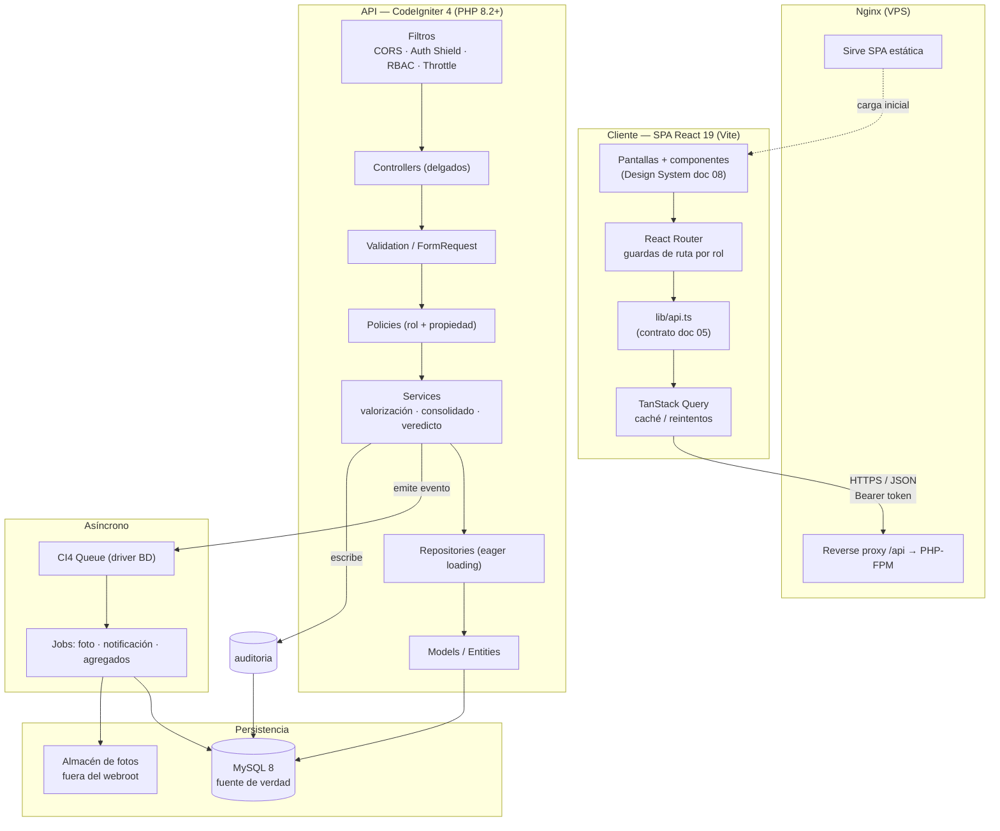
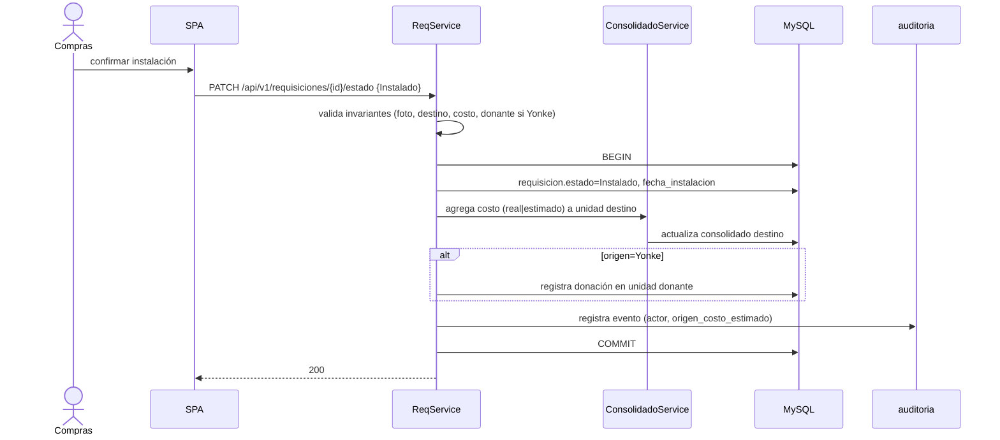
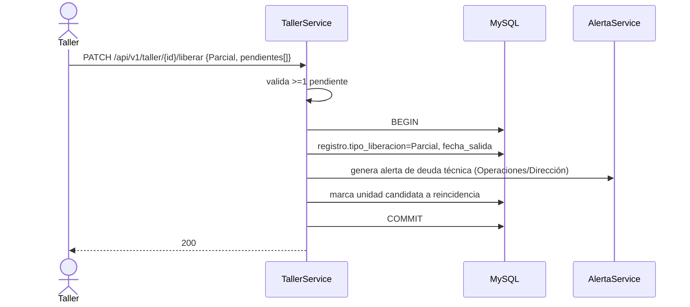
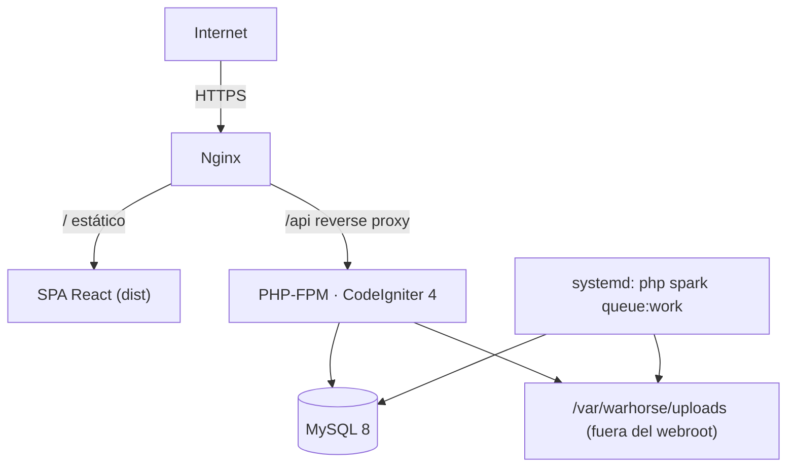

# 02 — Arquitectura del Sistema
## Warhorse — Hub Consolidador de Gastos por Tracto

| | |
|---|---|
| **Documento** | 02 — Arquitectura del Sistema |
| **Versión** | 2.0 |
| **Fecha** | 7 de julio de 2026 |
| **Depende de** | [ADR-001](ADR/ADR-001_stack-react-vite-ci4-api.md), [ADR-002](ADR/ADR-002_valorizacion-yonke-cascada.md), [ADR-003](ADR/ADR-003_demo-first-esqueleto-reutilizable.md), [01 SRS](../01-vision/01_SRS_especificacion_requisitos.md) |

> *v2.0: refleja el cambio de stack a cliente-servidor desacoplado (React 19 + Vite / API CI4 + MySQL) del [ADR-001](ADR/ADR-001_stack-react-vite-ci4-api.md). Sustituye cualquier supuesto de monolito Alpine de los archivos FRAGA.*

---

## 1. Principios rectores

**Fuente única de verdad en el servidor.** MySQL, mediado por la API de CodeIgniter 4, es la única autoridad de datos. El frontend nunca decide reglas ni calcula cifras de negocio: consume resultados. Es no negociable porque el sistema maneja el criterio financiero con el que Dirección decide dar de baja activos caros; un número calculado en el cliente sería manipulable e inauditable.

**Cliente no confiable.** Toda decisión de seguridad y de negocio se re-verifica server-side. La UI puede ocultar un botón por rol, pero el backend rechaza (403) cualquier acción fuera del ámbito del rol. Es no negociable porque el mayor riesgo del sistema no es un atacante externo sino un usuario autenticado que intente ver o alterar datos fuera de su función (IDOR, escalada de rol).

**La llave maestra es `id_unidad`.** Ninguna transacción existe desligada de una unidad válida. Es no negociable porque el propósito entero del sistema —consolidar gasto por tracto— colapsa si se permite una transacción huérfana.

**Honestidad del dato.** El sistema jamás presenta un costo estimado (Yonke) como si fuera facturado (Compra), y toda pieza canibalizada deja rastro de origen, destino y costo. Es no negociable porque el valor del sistema es hacer visible lo que hoy sale "en la sombra"; falsear un estimado como real arruinaría la confianza en el veredicto.

## 2. Estilo arquitectónico

**Cliente-servidor desacoplado (SPA + API REST).** Se elige sobre un monolito con vistas server-side (la línea FRAGA/Alpine) y sobre microservicios. Frente al monolito: el demo validado es una aplicación con estado compartido, ruteo y RBAC de navegación que React modela naturalmente y Alpine mal; además, desacoplar permite congelar el contrato de API con el demo (Demo-First) y testear la lógica server-side de forma aislada. Frente a microservicios: la escala (una flota, cuatro roles, decenas de miles de transacciones/mes) no justifica el costo operativo de múltiples servicios; un backend CI4 modular es suficiente y más barato de operar en un VPS. El razonamiento económico: un VPS único con Nginx + PHP-FPM + MySQL cubre la carga con costo predecible y hardening controlado.

### 2.1 Diagrama de capas



## 3. Descripción de capas

### 3.1 Capa de presentación / cliente (React 19)
**Responsabilidad:** presentar datos y capturar entrada; ocultar/mostrar según rol como comodidad de UX (no como seguridad). **Tecnología:** React 19 + TypeScript + Vite + Tailwind 4 + React Router + TanStack Query. **Reglas:** todo acceso a datos pasa por `lib/api.ts`; el estado remoto vive en TanStack Query; nada de lógica de negocio ni cálculos de rentabilidad. **No debe:** calcular el veredicto, decidir permisos, ni usar `dangerouslySetInnerHTML` sin DOMPurify.

### 3.2 Filtros / Middlewares (CI4)
**Responsabilidad:** CORS estricto (origen del front), verificación del token Shield, RBAC de entrada, throttling. **Reglas:** ningún request llega al controller sin pasar auth+CORS; las rutas mutantes pasan además por RBAC y throttle. **No debe:** contener lógica de negocio.

### 3.3 Controladores
**Responsabilidad:** orquestar: recibir request, delegar validación, invocar policy y service, formatear respuesta. **Reglas:** controllers delgados; una acción = un caso de uso. **No debe:** contener reglas de negocio ni SQL.

### 3.4 Validación y DTOs
**Responsabilidad:** validar y normalizar la entrada (tipos, obligatoriedad, enums) con las reglas de validación de CI4. **Reglas:** rechazar entrada malformada antes de tocar la lógica; validación numérica estricta en diésel/costos. **No debe:** autorizar (eso es de la policy).

### 3.5 Servicios de autorización (Policies)
**Responsabilidad:** decidir si el usuario autenticado puede ejecutar la acción sobre el recurso concreto (rol + propiedad). **Reglas:** verifican rol y pertenencia del recurso (anti-IDOR). **No debe:** ejecutar la operación.

### 3.6 Servicios de negocio
**Responsabilidad:** las reglas del dominio: valorización Yonke en cascada ([ADR-002](ADR/ADR-002_valorizacion-yonke-cascada.md)), consolidación del Costo Real Acumulado, cálculo del veredicto con umbral/ventana configurables, generación de alerta de deuda técnica y detección de reincidencia. **Reglas:** toda operación multi-tabla se ejecuta en transacción ACID; emite eventos para cola y auditoría. **No debe:** conocer HTTP.

### 3.7 Repositorios
**Responsabilidad:** acceso a datos con eager loading para evitar N+1 y selección de columnas específicas. **Reglas:** consultas verificables con `EXPLAIN`; nunca concatenación de SQL. **No debe:** contener reglas de negocio.

### 3.8 Modelos y Entidades
**Responsabilidad:** mapeo objeto-tabla, casts, prepared statements vía Query Builder. **Reglas:** los enums y checks se respaldan también en la BD (doc 03). **No debe:** exponer campos sensibles al serializar.

### 3.9 Cola y trabajos asíncronos
**Responsabilidad:** procesamiento diferido: redimensionado/almacenamiento de fotos, notificación a Compras, recálculo de agregados pesados del dashboard. **Reglas:** los jobs son idempotentes; sus fallos se reintentan y se registran. **No debe:** bloquear la request del usuario.

### 3.10 Eventos y auditoría
**Responsabilidad:** registrar en `auditoria` los eventos críticos (RF-INT-05) con actor, acción, entidad, valor anterior/nuevo y timestamp. **Reglas:** la auditoría se escribe dentro de la misma transacción del cambio que audita. **No debe:** poder desactivarse por un rol operativo.

## 4. Flujos de datos críticos

### 4.1 Login y aterrizaje por rol

```mermaid
sequenceDiagram
    actor U as Usuario
    participant FE as SPA React
    participant NG as Nginx
    participant AU as Filtro Auth (Shield)
    participant CT as AuthController
    participant DB as MySQL
    U->>FE: correo + contraseña
    FE->>NG: POST /api/v1/auth/login
    NG->>CT: proxy
    CT->>DB: verifica credenciales (hash Bcrypt/Argon2id)
    alt credenciales válidas y usuario activo
        CT->>DB: emite token de acceso (Shield)
        CT-->>FE: 200 {token, rol}
        FE->>FE: guarda token; ruta según rol
    else inválidas o suspendido
        CT-->>FE: 401 (sin revelar causa)
    end
```

### 4.2 Creación de requisición Yonke (foto + valorización en cascada)

```mermaid
sequenceDiagram
    actor T as Taller
    participant FE as SPA
    participant AU as Auth+RBAC
    participant VC as Validation
    participant PO as Policy
    participant SV as ReqService
    participant VAL as ValorizacionService
    participant DB as MySQL
    participant Q as Cola
    T->>FE: destino, origen=Yonke, donante, pieza, foto
    FE->>AU: POST /api/v1/requisiciones (Bearer)
    AU->>VC: token válido, rol=Taller
    VC->>PO: entrada válida (foto presente, donante presente)
    PO->>SV: autorizado (Taller crea)
    SV->>VAL: estimar costo (A→C→manual)
    VAL->>DB: busca última compra / catálogo
    VAL-->>SV: costo_estimado + origen_costo_estimado
    SV->>DB: BEGIN; inserta requisición (Solicitado); COMMIT
    SV->>Q: encola job foto + notificación a Compras
    SV-->>FE: 201 {requisicion, costo_estimado, origen}
```

### 4.3 Instalación de requisición (transacción multi-tabla)



### 4.4 Liberación parcial (mejoralito) y deuda técnica



## 5. Patrones de implementación

**Controlador delgado (CI4):**

```php
<?php
namespace App\Controllers\Api\V1;

use App\Controllers\BaseController;
use App\Services\RequisicionService;
use App\Validation\RequisicionRules;

final class RequisicionController extends BaseController
{
    public function __construct(private readonly RequisicionService $service) {}

    public function create(): \CodeIgniter\HTTP\ResponseInterface
    {
        $data = $this->request->getJSON(true);

        if (! $this->validateData($data, RequisicionRules::create())) {
            return $this->response->setStatusCode(422)
                ->setJSON(['error' => 'validation', 'fields' => $this->validator->getErrors()]);
        }

        // El usuario y su rol vienen de la sesión Shield, NUNCA del payload.
        $actor = auth()->user();
        $requisicion = $this->service->crear($data, $actor); // policy + valorización + tx dentro

        return $this->response->setStatusCode(201)->setJSON($requisicion->toArray());
    }
}
```

**Validación → policy → service encadenados (dentro del service):**

```php
public function crear(array $data, User $actor): Requisicion
{
    $this->policy->authorizeCreate($actor);              // rol Taller

    if ($data['origen'] === 'Yonke') {
        if (empty($data['unidad_donante_id'])) {
            throw new BusinessException('Yonke obliga a registrar la unidad donante.');
        }
        [$costo, $origenCosto] = $this->valorizacion->estimar($data); // A→C→manual, nunca 0
        $data['costo_estimado']        = $costo;
        $data['origen_costo_estimado'] = $origenCosto;
    }

    if (empty($data['foto_pieza_url'])) {
        throw new BusinessException('La foto de la pieza es obligatoria.');
    }

    return $this->repo->insert($data); // prepared statements vía Model
}
```

**Transacción multi-tabla (instalación):**

```php
public function instalar(int $id, User $actor): void
{
    $this->policy->authorizeManage($actor);   // rol Compras
    $req = $this->repo->findOrFail($id);
    $this->assertInvariantes($req);           // foto, destino, costo, donante si Yonke

    $this->db->transStart();
    $this->repo->marcarInstalado($id);
    $this->consolidado->agregarCostoRefaccion($req->unidad_destino_id, $req->costoEfectivo());
    if ($req->origen === 'Yonke') {
        $this->repo->registrarDonacion($req->unidad_donante_id, $id);
    }
    $this->auditoria->registrar($actor, 'requisicion.instalada', $req, ['origen_costo' => $req->origen_costo_estimado]);
    $this->db->transComplete();               // COMMIT o ROLLBACK atómico
}
```

**Emisión/verificación de autenticación (Shield):**

```php
// Filtro de ruta protegida (Config/Filters.php mapea 'api-auth' + 'rbac:rol')
public function before(RequestInterface $request, $arguments = null)
{
    if (! auth('tokens')->loggedIn()) {
        return service('response')->setStatusCode(401)->setJSON(['error' => 'unauthenticated']);
    }
    $rolRequerido = $arguments[0] ?? null;
    if ($rolRequerido && ! auth()->user()->inGroup($rolRequerido)) {
        return service('response')->setStatusCode(403)->setJSON(['error' => 'forbidden']);
    }
}
```

## 6. Estrategia de despliegue

- **Infraestructura:** un VPS Linux (Ubuntu LTS). Nginx sirve la SPA estática (build de Vite) y hace reverse proxy de `/api` a PHP-FPM (CodeIgniter 4). MySQL 8 local al VPS o gestionado. Un proceso `queue:work` como servicio systemd. Almacén de fotos en un directorio fuera del webroot.



**Checklist de hardening de producción:**
- HTTPS forzado (HSTS); TLS moderno.
- `.env` fuera de Git y con permisos restringidos; `CI_ENVIRONMENT=production`.
- Directorio de la API no accesible directo por browser (solo vía Nginx a `public/`).
- Fotos servidas por un controlador autorizado, nunca por ruta pública directa.
- Cookies de refresh `HttpOnly` + `Secure` + `SameSite`; token de acceso en memoria del SPA.
- CORS restringido al origen del front.
- Cabeceras de seguridad (CSP, X-Content-Type-Options, Referrer-Policy).
- MySQL con usuario de mínimos privilegios para la app.
- Backups automáticos de BD y del almacén de fotos.
- `setup_admin` (si se usa para el primer admin) eliminado tras el bootstrap.

## 7. Decisiones de diseño pendientes / riesgos técnicos

| Decisión / riesgo | Opciones consideradas | Estado |
|---|---|---|
| Canal de notificación a Compras | Correo (cola) vs. WhatsApp Business API | MVP: correo/cola; WhatsApp en backlog |
| Regla contable de valorización Yonke | Cascada de trabajo vs. regla formal de finanzas | Cascada decidida en [ADR-002](ADR/ADR-002_valorizacion-yonke-cascada.md); formal pendiente de finanzas |
| Adopción del taller (baja estandarización) | — | Riesgo alto; mitigado con métricas de salud de datos (SRS §9) y flujo móvil sin fricción |
| OCR de Hoja Blanca | OCR vs. captura rápida manual | Fuera de MVP (backlog) |
| Verificación de módulos Diésel/Compras | Contra fuente secundaria hoy | Pendiente onboarding raw (SRS §10) |
