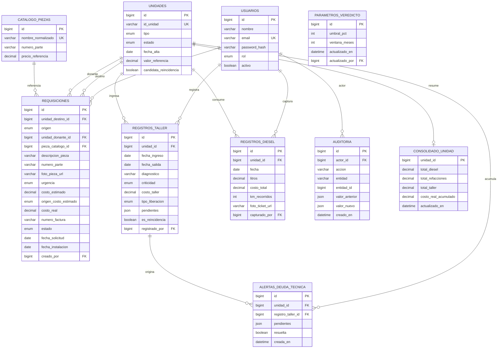

# 03 — Modelo de Datos
## Warhorse — Hub Consolidador de Gastos por Tracto

| | |
|---|---|
| **Documento** | 03 — Modelo de Datos |
| **Versión** | 2.0 |
| **Fecha** | 7 de julio de 2026 |
| **Motor** | MySQL 8.0 (InnoDB, utf8mb4) |
| **Normalización** | 3NF, con desnormalización controlada de agregados de consolidado |
| **Depende de** | [01 SRS](../01-vision/01_SRS_especificacion_requisitos.md), [ADR-002](../02-arquitectura/ADR/ADR-002_valorizacion-yonke-cascada.md) |

> *v2.0: modelo alineado al stack CI4 + MySQL ([ADR-001](../02-arquitectura/ADR/ADR-001_stack-react-vite-ci4-api.md)). Se unifica la nomenclatura del demo (`valor_estimado`, `tracto_destino_id`) con la de la spec funcional (`valor_referencia`, `unidad_destino_id`); prevalece la de la spec funcional por ser la fuente contractual, y se documenta el mapeo.*

---

## 1. Diagrama Entidad-Relación



## 2. Diccionario de datos

Convenciones: PK entera `id` autoincremental `BIGINT UNSIGNED`; llaves de negocio (`id_unidad`) como `VARCHAR` únicos; montos `DECIMAL(12,2)`; texto `utf8mb4_0900_ai_ci`; enums respaldados por `CHECK` además del tipo `ENUM`.

#### `unidades`
Activo físico de la flota. Entidad ancla; toda transacción la referencia.

| Columna | Tipo | Nullable | Default | Restricciones | Descripción |
|---|---|---|---|---|---|
| `id` | BIGINT UNSIGNED | No | AUTO_INC | PK | Identificador interno. |
| `id_unidad` | VARCHAR(20) | No | — | UNIQUE | Llave de negocio humana (WH125). |
| `tipo` | ENUM('Tractor','Caja','Thermo') | No | — | CHECK | Tipo de activo. |
| `estado` | ENUM('Activo','Yonke','Inactivo') | No | 'Activo' | CHECK | Estado operativo (§máquina 4.1 SRS). |
| `fecha_alta` | DATE | No | — | | Ingreso a la flota. |
| `valor_referencia` | DECIMAL(12,2) | Sí | NULL | ≥ 0 | Valor financiero (Dirección). Base del veredicto. NULL = pendiente. |
| `candidata_reincidencia` | BOOLEAN | No | 0 | | Marcada tras un mejoralito. |
| `created_at` / `updated_at` | DATETIME | No | CURRENT | | Timestamps CI4. |

#### `usuarios`
Cuentas del sistema. PII mínima (nombre, correo).

| Columna | Tipo | Nullable | Default | Restricciones | Descripción |
|---|---|---|---|---|---|
| `id` | BIGINT UNSIGNED | No | AUTO_INC | PK | |
| `nombre` | VARCHAR(120) | No | — | | Nombre para mostrar. |
| `email` | VARCHAR(180) | No | — | UNIQUE | Login. |
| `password_hash` | VARCHAR(255) | No | — | | Bcrypt/Argon2id (gestionado por Shield). |
| `rol` | ENUM('admin','taller','compras','diesel') | No | — | CHECK | Rol técnico (§2.2 SRS). |
| `activo` | BOOLEAN | No | 1 | | Suspendido = 0 (no puede autenticarse). |
| `created_at` / `updated_at` | DATETIME | No | CURRENT | | |

> Nota: con CI4 Shield, la autenticación usa sus tablas (`auth_identities`, `auth_tokens`, etc.). `usuarios` es la tabla de dominio del sistema; se enlaza 1:1 con la identidad de Shield por `email`/`user_id`. `rol` se mapea a los grupos de Shield.

#### `registros_diesel`
Una carga de combustible.

| Columna | Tipo | Nullable | Default | Restricciones | Descripción |
|---|---|---|---|---|---|
| `id` | BIGINT UNSIGNED | No | AUTO_INC | PK | |
| `unidad_id` | BIGINT UNSIGNED | No | — | FK→unidades ON DELETE RESTRICT | Unidad que cargó. |
| `fecha` | DATE | No | — | | Fecha de carga. |
| `litros` | DECIMAL(10,2) | No | — | > 0 | Numérico estricto. |
| `costo_total` | DECIMAL(12,2) | No | — | > 0 | Numérico estricto (rechaza texto). |
| `km_recorridos` | INT UNSIGNED | No | — | ≥ 0 | Para eficiencia. |
| `foto_ticket_url` | VARCHAR(255) | Sí | NULL | | Evidencia opcional. |
| `capturado_por` | BIGINT UNSIGNED | No | — | FK→usuarios | Rol Diésel. |
| `created_at` | DATETIME | No | CURRENT | | |

#### `requisiciones`
Solicitud de una refacción. Entidad más rica en reglas.

| Columna | Tipo | Nullable | Default | Restricciones | Descripción |
|---|---|---|---|---|---|
| `id` | BIGINT UNSIGNED | No | AUTO_INC | PK | |
| `unidad_destino_id` | BIGINT UNSIGNED | No | — | FK→unidades ON DELETE RESTRICT | Tracto que recibe. Obligatorio. |
| `origen` | ENUM('Compra','Yonke') | No | — | CHECK | Determina la lógica posterior. |
| `unidad_donante_id` | BIGINT UNSIGNED | Sí | NULL | FK→unidades | Obligatorio si origen=Yonke; debe ser unidad Yonke. NULL si Compra. |
| `pieza_catalogo_id` | BIGINT UNSIGNED | Sí | NULL | FK→catalogo_piezas | Referencia normalizada opcional. |
| `descripcion_pieza` | VARCHAR(180) | No | — | | Qué pieza. |
| `numero_parte` | VARCHAR(80) | Sí | NULL | | Número sugerido. |
| `foto_pieza_url` | VARCHAR(255) | No | — | | Evidencia **obligatoria** (regla dura). |
| `urgencia` | ENUM('Rápida','Media','Crítica') | No | 'Media' | CHECK | Ordena la cola de Compras. |
| `costo_estimado` | DECIMAL(12,2) | Sí | NULL | ≥ 0 | Estimado (Yonke) por cascada. |
| `origen_costo_estimado` | ENUM('ultima_compra','catalogo','manual') | Sí | NULL | CHECK | Confiabilidad del estimado ([ADR-002](../02-arquitectura/ADR/ADR-002_valorizacion-yonke-cascada.md)). |
| `costo_real` | DECIMAL(12,2) | Sí | NULL | ≥ 0 | Facturado (solo Compra). |
| `numero_factura` | VARCHAR(80) | Sí | NULL | | Solo Compra. |
| `estado` | ENUM('Solicitado','Cotizado','Comprado','Instalado') | No | 'Solicitado' | CHECK | Ciclo (§4.2 SRS). |
| `fecha_solicitud` | DATE | No | — | | |
| `fecha_instalacion` | DATE | Sí | NULL | | Nula hasta instalar. |
| `creado_por` | BIGINT UNSIGNED | No | — | FK→usuarios | Rol Taller. |
| `created_at` / `updated_at` | DATETIME | No | CURRENT | | |

**Reglas de integridad respaldadas por CHECK/lógica:** Yonke ⇒ `unidad_donante_id` no nulo y `numero_factura` nulo; Compra ⇒ `unidad_donante_id` nulo. Estas invariantes se validan en el `Service` y se refuerzan con constraints (ver DDL §4).

#### `registros_taller`
Un ingreso de unidad a taller.

| Columna | Tipo | Nullable | Default | Restricciones | Descripción |
|---|---|---|---|---|---|
| `id` | BIGINT UNSIGNED | No | AUTO_INC | PK | |
| `unidad_id` | BIGINT UNSIGNED | No | — | FK→unidades ON DELETE RESTRICT | |
| `fecha_ingreso` | DATE | No | — | | |
| `fecha_salida` | DATE | Sí | NULL | ≥ fecha_ingreso | Nula mientras esté en taller. |
| `diagnostico` | VARCHAR(255) | No | — | | Falla principal. |
| `criticidad` | ENUM('Rápida','Media','Crítico') | No | — | CHECK | Expectativa, no promesa. |
| `costo_taller` | DECIMAL(12,2) | No | 0 | ≥ 0 | Mano de obra/servicio. |
| `tipo_liberacion` | ENUM('Total','Parcial') | Sí | NULL | CHECK | NULL mientras "En Taller". |
| `pendientes` | JSON | Sí | NULL | | Fallas no resueltas si Parcial. |
| `es_reincidencia` | BOOLEAN | No | 0 | | Reingreso por misma falla tras mejoralito. |
| `registrado_por` | BIGINT UNSIGNED | No | — | FK→usuarios | Rol Taller. |
| `created_at` / `updated_at` | DATETIME | No | CURRENT | | |

Campo derivado (no persistido): `dias_en_taller = DATEDIFF(fecha_salida, fecha_ingreso)`; se calcula al leer.

#### `catalogo_piezas`
Referencia de refacciones comunes; evita texto libre y alimenta el fallback C de valorización.

| Columna | Tipo | Nullable | Default | Restricciones | Descripción |
|---|---|---|---|---|---|
| `id` | BIGINT UNSIGNED | No | AUTO_INC | PK | |
| `nombre_normalizado` | VARCHAR(180) | No | — | UNIQUE | Nombre canónico. |
| `numero_parte` | VARCHAR(80) | Sí | NULL | | |
| `precio_referencia` | DECIMAL(12,2) | No | — | > 0 | Fallback C. |
| `created_at` / `updated_at` | DATETIME | No | CURRENT | | |

#### `consolidado_unidad`
Agregado desnormalizado del Costo Real Acumulado por unidad. Se mantiene por el `ConsolidadoService` en cada transacción para lecturas O(1) del Dashboard.

| Columna | Tipo | Nullable | Default | Restricciones | Descripción |
|---|---|---|---|---|---|
| `unidad_id` | BIGINT UNSIGNED | No | — | PK, FK→unidades ON DELETE CASCADE | 1:1 con unidad. |
| `total_diesel` | DECIMAL(14,2) | No | 0 | ≥ 0 | Suma de diésel. |
| `total_refacciones` | DECIMAL(14,2) | No | 0 | ≥ 0 | Compradas + Yonke estimadas. |
| `total_taller` | DECIMAL(14,2) | No | 0 | ≥ 0 | Mano de obra/servicio. |
| `costo_real_acumulado` | DECIMAL(14,2) | No | 0 | ≥ 0 | Suma de los tres (columna generada). |
| `actualizado_en` | DATETIME | No | CURRENT | | |

#### `alertas_deuda_tecnica`
Generada por una liberación parcial.

| Columna | Tipo | Nullable | Default | Restricciones | Descripción |
|---|---|---|---|---|---|
| `id` | BIGINT UNSIGNED | No | AUTO_INC | PK | |
| `unidad_id` | BIGINT UNSIGNED | No | — | FK→unidades | |
| `registro_taller_id` | BIGINT UNSIGNED | No | — | FK→registros_taller | |
| `pendientes` | JSON | No | — | | Copia de las fallas pendientes. |
| `resuelta` | BOOLEAN | No | 0 | | |
| `creada_en` | DATETIME | No | CURRENT | | |

#### `parametros_veredicto`
Parámetros configurables del veredicto (una fila viva; historial por auditoría).

| Columna | Tipo | Nullable | Default | Restricciones | Descripción |
|---|---|---|---|---|---|
| `id` | BIGINT UNSIGNED | No | AUTO_INC | PK | |
| `umbral_pct` | TINYINT UNSIGNED | No | 40 | BETWEEN 20 AND 80 | % del valor que dispara "vender". |
| `ventana_meses` | TINYINT UNSIGNED | No | 12 | BETWEEN 1 AND 36 | Ventana de acumulación. |
| `actualizado_en` | DATETIME | No | CURRENT | | |
| `actualizado_por` | BIGINT UNSIGNED | No | — | FK→usuarios | Solo Dirección. |

> El default 40% corresponde al `umbralVender` del demo; la spec sugiere 50% como referencia. Se deja configurable con default 40 y rango 20–80 (coherente con el demo).

#### `auditoria`
Bitácora inmutable de eventos críticos (RF-INT-05).

| Columna | Tipo | Nullable | Default | Restricciones | Descripción |
|---|---|---|---|---|---|
| `id` | BIGINT UNSIGNED | No | AUTO_INC | PK | |
| `actor_id` | BIGINT UNSIGNED | No | — | FK→usuarios | Quién ejecutó. |
| `accion` | VARCHAR(80) | No | — | | ej. `requisicion.instalada`. |
| `entidad` | VARCHAR(60) | No | — | | Tabla afectada. |
| `entidad_id` | BIGINT UNSIGNED | No | — | | PK afectada. |
| `valor_anterior` | JSON | Sí | NULL | | Estado previo. |
| `valor_nuevo` | JSON | Sí | NULL | | Estado nuevo. |
| `creado_en` | DATETIME | No | CURRENT | | |

## 3. Mapeo de nomenclatura demo ↔ modelo

| Demo (mock) | Modelo (BD) | Nota |
|---|---|---|
| `valor_estimado` | `valor_referencia` | Mismo concepto; prevalece la spec funcional. |
| `tracto_destino_id` | `unidad_destino_id` | Renombrado por consistencia con entidad Unidad. |
| `tracto_donante_id` | `unidad_donante_id` | Ídem. |
| `costo_estimado_taller` | `costo_taller` | En `registros_taller`. |
| `dias_en_taller` | derivado `DATEDIFF` | No se persiste. |
| `pct_mejoralito` | derivado de `tipo_liberacion` | Calculado en el veredicto. |

## 4. DDL completo (MySQL 8)

```sql
-- Warhorse — esquema MySQL 8 (InnoDB, utf8mb4). Ejecutable sin placeholders.
SET NAMES utf8mb4;
SET FOREIGN_KEY_CHECKS = 1;

CREATE TABLE unidades (
    id                      BIGINT UNSIGNED NOT NULL AUTO_INCREMENT,
    id_unidad               VARCHAR(20)     NOT NULL,
    tipo                    ENUM('Tractor','Caja','Thermo') NOT NULL,
    estado                  ENUM('Activo','Yonke','Inactivo') NOT NULL DEFAULT 'Activo',
    fecha_alta              DATE            NOT NULL,
    valor_referencia        DECIMAL(12,2)   NULL,
    candidata_reincidencia  BOOLEAN         NOT NULL DEFAULT 0,
    created_at              DATETIME        NOT NULL DEFAULT CURRENT_TIMESTAMP,
    updated_at              DATETIME        NOT NULL DEFAULT CURRENT_TIMESTAMP ON UPDATE CURRENT_TIMESTAMP,
    PRIMARY KEY (id),
    UNIQUE KEY uk_unidades_id_unidad (id_unidad),
    KEY idx_unidades_estado (estado),
    CONSTRAINT chk_unidades_valor CHECK (valor_referencia IS NULL OR valor_referencia >= 0)
) ENGINE=InnoDB DEFAULT CHARSET=utf8mb4 COLLATE=utf8mb4_0900_ai_ci;

CREATE TABLE usuarios (
    id             BIGINT UNSIGNED NOT NULL AUTO_INCREMENT,
    nombre         VARCHAR(120)    NOT NULL,
    email          VARCHAR(180)    NOT NULL,
    password_hash  VARCHAR(255)    NOT NULL,
    rol            ENUM('admin','taller','compras','diesel') NOT NULL,
    activo         BOOLEAN         NOT NULL DEFAULT 1,
    created_at     DATETIME        NOT NULL DEFAULT CURRENT_TIMESTAMP,
    updated_at     DATETIME        NOT NULL DEFAULT CURRENT_TIMESTAMP ON UPDATE CURRENT_TIMESTAMP,
    PRIMARY KEY (id),
    UNIQUE KEY uk_usuarios_email (email),
    KEY idx_usuarios_rol (rol)
) ENGINE=InnoDB DEFAULT CHARSET=utf8mb4 COLLATE=utf8mb4_0900_ai_ci;

CREATE TABLE catalogo_piezas (
    id                  BIGINT UNSIGNED NOT NULL AUTO_INCREMENT,
    nombre_normalizado  VARCHAR(180)    NOT NULL,
    numero_parte        VARCHAR(80)     NULL,
    precio_referencia   DECIMAL(12,2)   NOT NULL,
    created_at          DATETIME        NOT NULL DEFAULT CURRENT_TIMESTAMP,
    updated_at          DATETIME        NOT NULL DEFAULT CURRENT_TIMESTAMP ON UPDATE CURRENT_TIMESTAMP,
    PRIMARY KEY (id),
    UNIQUE KEY uk_pieza_nombre (nombre_normalizado),
    KEY idx_pieza_numparte (numero_parte),
    CONSTRAINT chk_pieza_precio CHECK (precio_referencia > 0)
) ENGINE=InnoDB DEFAULT CHARSET=utf8mb4 COLLATE=utf8mb4_0900_ai_ci;

CREATE TABLE registros_diesel (
    id              BIGINT UNSIGNED NOT NULL AUTO_INCREMENT,
    unidad_id       BIGINT UNSIGNED NOT NULL,
    fecha           DATE            NOT NULL,
    litros          DECIMAL(10,2)   NOT NULL,
    costo_total     DECIMAL(12,2)   NOT NULL,
    km_recorridos   INT UNSIGNED    NOT NULL,
    foto_ticket_url VARCHAR(255)    NULL,
    capturado_por   BIGINT UNSIGNED NOT NULL,
    created_at      DATETIME        NOT NULL DEFAULT CURRENT_TIMESTAMP,
    PRIMARY KEY (id),
    KEY idx_diesel_unidad_fecha (unidad_id, fecha),
    CONSTRAINT fk_diesel_unidad   FOREIGN KEY (unidad_id)     REFERENCES unidades(id) ON DELETE RESTRICT,
    CONSTRAINT fk_diesel_usuario  FOREIGN KEY (capturado_por) REFERENCES usuarios(id) ON DELETE RESTRICT,
    CONSTRAINT chk_diesel_litros  CHECK (litros > 0),
    CONSTRAINT chk_diesel_costo   CHECK (costo_total > 0),
    CONSTRAINT chk_diesel_km      CHECK (km_recorridos >= 0)
) ENGINE=InnoDB DEFAULT CHARSET=utf8mb4 COLLATE=utf8mb4_0900_ai_ci;

CREATE TABLE requisiciones (
    id                    BIGINT UNSIGNED NOT NULL AUTO_INCREMENT,
    unidad_destino_id     BIGINT UNSIGNED NOT NULL,
    origen                ENUM('Compra','Yonke') NOT NULL,
    unidad_donante_id     BIGINT UNSIGNED NULL,
    pieza_catalogo_id     BIGINT UNSIGNED NULL,
    descripcion_pieza     VARCHAR(180)    NOT NULL,
    numero_parte          VARCHAR(80)     NULL,
    foto_pieza_url        VARCHAR(255)    NOT NULL,
    urgencia              ENUM('Rápida','Media','Crítica') NOT NULL DEFAULT 'Media',
    costo_estimado        DECIMAL(12,2)   NULL,
    origen_costo_estimado ENUM('ultima_compra','catalogo','manual') NULL,
    costo_real            DECIMAL(12,2)   NULL,
    numero_factura        VARCHAR(80)     NULL,
    estado                ENUM('Solicitado','Cotizado','Comprado','Instalado') NOT NULL DEFAULT 'Solicitado',
    fecha_solicitud       DATE            NOT NULL,
    fecha_instalacion     DATE            NULL,
    creado_por            BIGINT UNSIGNED NOT NULL,
    created_at            DATETIME        NOT NULL DEFAULT CURRENT_TIMESTAMP,
    updated_at            DATETIME        NOT NULL DEFAULT CURRENT_TIMESTAMP ON UPDATE CURRENT_TIMESTAMP,
    PRIMARY KEY (id),
    KEY idx_req_destino (unidad_destino_id),
    KEY idx_req_donante (unidad_donante_id),
    KEY idx_req_estado_urgencia (estado, urgencia),
    CONSTRAINT fk_req_destino  FOREIGN KEY (unidad_destino_id) REFERENCES unidades(id)        ON DELETE RESTRICT,
    CONSTRAINT fk_req_donante  FOREIGN KEY (unidad_donante_id) REFERENCES unidades(id)        ON DELETE RESTRICT,
    CONSTRAINT fk_req_pieza    FOREIGN KEY (pieza_catalogo_id) REFERENCES catalogo_piezas(id) ON DELETE SET NULL,
    CONSTRAINT fk_req_usuario  FOREIGN KEY (creado_por)        REFERENCES usuarios(id)        ON DELETE RESTRICT,
    -- Invariantes de negocio (§7 SRS) reforzadas en BD:
    CONSTRAINT chk_req_yonke_donante CHECK (
        (origen = 'Yonke' AND unidad_donante_id IS NOT NULL AND numero_factura IS NULL)
        OR (origen = 'Compra' AND unidad_donante_id IS NULL)
    ),
    CONSTRAINT chk_req_costos CHECK (
        (costo_estimado IS NULL OR costo_estimado >= 0)
        AND (costo_real IS NULL OR costo_real >= 0)
    ),
    CONSTRAINT chk_req_origen_costo CHECK (
        origen_costo_estimado IS NULL OR origen = 'Yonke'
    )
) ENGINE=InnoDB DEFAULT CHARSET=utf8mb4 COLLATE=utf8mb4_0900_ai_ci;

CREATE TABLE registros_taller (
    id               BIGINT UNSIGNED NOT NULL AUTO_INCREMENT,
    unidad_id        BIGINT UNSIGNED NOT NULL,
    fecha_ingreso    DATE            NOT NULL,
    fecha_salida     DATE            NULL,
    diagnostico      VARCHAR(255)    NOT NULL,
    criticidad       ENUM('Rápida','Media','Crítico') NOT NULL,
    costo_taller     DECIMAL(12,2)   NOT NULL DEFAULT 0,
    tipo_liberacion  ENUM('Total','Parcial') NULL,
    pendientes       JSON            NULL,
    es_reincidencia  BOOLEAN         NOT NULL DEFAULT 0,
    registrado_por   BIGINT UNSIGNED NOT NULL,
    created_at       DATETIME        NOT NULL DEFAULT CURRENT_TIMESTAMP,
    updated_at       DATETIME        NOT NULL DEFAULT CURRENT_TIMESTAMP ON UPDATE CURRENT_TIMESTAMP,
    PRIMARY KEY (id),
    KEY idx_taller_unidad (unidad_id),
    KEY idx_taller_ingreso (fecha_ingreso),
    CONSTRAINT fk_taller_unidad  FOREIGN KEY (unidad_id)      REFERENCES unidades(id) ON DELETE RESTRICT,
    CONSTRAINT fk_taller_usuario FOREIGN KEY (registrado_por) REFERENCES usuarios(id) ON DELETE RESTRICT,
    CONSTRAINT chk_taller_costo  CHECK (costo_taller >= 0),
    CONSTRAINT chk_taller_fechas CHECK (fecha_salida IS NULL OR fecha_salida >= fecha_ingreso),
    CONSTRAINT chk_taller_parcial CHECK (
        tipo_liberacion <> 'Parcial' OR (pendientes IS NOT NULL AND JSON_LENGTH(pendientes) >= 1)
    )
) ENGINE=InnoDB DEFAULT CHARSET=utf8mb4 COLLATE=utf8mb4_0900_ai_ci;

CREATE TABLE consolidado_unidad (
    unidad_id            BIGINT UNSIGNED NOT NULL,
    total_diesel         DECIMAL(14,2)   NOT NULL DEFAULT 0,
    total_refacciones    DECIMAL(14,2)   NOT NULL DEFAULT 0,
    total_taller         DECIMAL(14,2)   NOT NULL DEFAULT 0,
    costo_real_acumulado DECIMAL(14,2)   AS (total_diesel + total_refacciones + total_taller) STORED,
    actualizado_en       DATETIME        NOT NULL DEFAULT CURRENT_TIMESTAMP ON UPDATE CURRENT_TIMESTAMP,
    PRIMARY KEY (unidad_id),
    CONSTRAINT fk_consol_unidad FOREIGN KEY (unidad_id) REFERENCES unidades(id) ON DELETE CASCADE,
    CONSTRAINT chk_consol_nonneg CHECK (total_diesel >= 0 AND total_refacciones >= 0 AND total_taller >= 0)
) ENGINE=InnoDB DEFAULT CHARSET=utf8mb4 COLLATE=utf8mb4_0900_ai_ci;

CREATE TABLE alertas_deuda_tecnica (
    id                 BIGINT UNSIGNED NOT NULL AUTO_INCREMENT,
    unidad_id          BIGINT UNSIGNED NOT NULL,
    registro_taller_id BIGINT UNSIGNED NOT NULL,
    pendientes         JSON            NOT NULL,
    resuelta           BOOLEAN         NOT NULL DEFAULT 0,
    creada_en          DATETIME        NOT NULL DEFAULT CURRENT_TIMESTAMP,
    PRIMARY KEY (id),
    KEY idx_alerta_unidad (unidad_id, resuelta),
    CONSTRAINT fk_alerta_unidad FOREIGN KEY (unidad_id)          REFERENCES unidades(id)         ON DELETE CASCADE,
    CONSTRAINT fk_alerta_taller FOREIGN KEY (registro_taller_id) REFERENCES registros_taller(id) ON DELETE CASCADE
) ENGINE=InnoDB DEFAULT CHARSET=utf8mb4 COLLATE=utf8mb4_0900_ai_ci;

CREATE TABLE parametros_veredicto (
    id              BIGINT UNSIGNED NOT NULL AUTO_INCREMENT,
    umbral_pct      TINYINT UNSIGNED NOT NULL DEFAULT 40,
    ventana_meses   TINYINT UNSIGNED NOT NULL DEFAULT 12,
    actualizado_en  DATETIME        NOT NULL DEFAULT CURRENT_TIMESTAMP ON UPDATE CURRENT_TIMESTAMP,
    actualizado_por BIGINT UNSIGNED NOT NULL,
    PRIMARY KEY (id),
    CONSTRAINT fk_param_usuario FOREIGN KEY (actualizado_por) REFERENCES usuarios(id) ON DELETE RESTRICT,
    CONSTRAINT chk_param_umbral  CHECK (umbral_pct BETWEEN 20 AND 80),
    CONSTRAINT chk_param_ventana CHECK (ventana_meses BETWEEN 1 AND 36)
) ENGINE=InnoDB DEFAULT CHARSET=utf8mb4 COLLATE=utf8mb4_0900_ai_ci;

CREATE TABLE auditoria (
    id             BIGINT UNSIGNED NOT NULL AUTO_INCREMENT,
    actor_id       BIGINT UNSIGNED NOT NULL,
    accion         VARCHAR(80)     NOT NULL,
    entidad        VARCHAR(60)     NOT NULL,
    entidad_id     BIGINT UNSIGNED NOT NULL,
    valor_anterior JSON            NULL,
    valor_nuevo    JSON            NULL,
    creado_en      DATETIME        NOT NULL DEFAULT CURRENT_TIMESTAMP,
    PRIMARY KEY (id),
    KEY idx_aud_entidad (entidad, entidad_id),
    KEY idx_aud_actor (actor_id),
    CONSTRAINT fk_aud_actor FOREIGN KEY (actor_id) REFERENCES usuarios(id) ON DELETE RESTRICT
) ENGINE=InnoDB DEFAULT CHARSET=utf8mb4 COLLATE=utf8mb4_0900_ai_ci;
```

## 5. Justificaciones de diseño

- **`consolidado_unidad` desnormalizado (columna generada STORED).** El Dashboard lee costos por unidad en cada carga; recalcular sumas sobre tres tablas transaccionales en cada lectura sería O(n) y N+1-prone. Se mantiene el agregado en cada transacción (dentro de la tx ACID) para lecturas O(1). `costo_real_acumulado` es columna generada para garantizar coherencia con los tres términos.
- **`ON DELETE RESTRICT` en transacciones.** Nunca se debe borrar una unidad con historial; se marca Inactiva (RF-UNI-03). RESTRICT protege la integridad del consolidado histórico.
- **CHECK de invariantes en `requisiciones`.** Yonke↔donante y Compra↔sin-donante/sin-factura se refuerzan en BD además del `Service` (defensa en profundidad); un bug de aplicación no puede dejar datos inconsistentes.
- **Índice compuesto `(estado, urgencia)` en requisiciones.** El panel de Compras filtra por estado y ordena por urgencia; el índice cubre esa consulta y evita filesort.
- **Índice `(unidad_id, fecha)` en diésel.** La ficha y la eficiencia agregan por unidad en rango de fechas.
- **`JSON` para `pendientes`.** Lista variable de fallas; consultada por longitud (CHECK) y presentada, no filtrada por contenido — JSON es adecuado sin sobre-normalizar.
- **`DECIMAL` en todos los montos.** Nunca `FLOAT`: se manejan pesos mexicanos y el veredicto financiero exige exactitud.
- **`utf8mb4_0900_ai_ci`.** Soporta acentos y caracteres del español (diagnósticos, nombres) sin pérdida.
