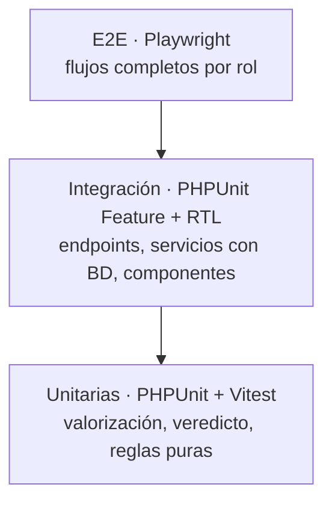

# 06 — Plan de Pruebas
## Warhorse — Hub Consolidador de Gastos por Tracto

| | |
|---|---|
| **Documento** | 06 — Plan de Pruebas |
| **Versión** | 2.0 |
| **Fecha** | 7 de julio de 2026 |
| **Frameworks** | Backend: PHPUnit (CI4) + PHPStan nivel 8. Frontend: Vitest + React Testing Library + Playwright (E2E). |
| **Cobertura objetivo** | ≥ 80% de líneas en Services; 100% de transiciones de estado; 100% de RF críticos. |
| **Depende de** | [01 SRS](../01-vision/01_SRS_especificacion_requisitos.md), [05 API](../05-api/05_especificacion_api.md), [04 Seguridad](../04-seguridad/04_plan_de_seguridad.md) |

---

## 1. Estrategia

| Tipo | Herramienta | Qué cubre |
|---|---|---|
| Unitaria backend | PHPUnit | Servicios puros: cascada de valorización, cálculo de veredicto, invariantes de requisición. |
| Unitaria frontend | Vitest + RTL | Componentes, validación de formulario de requisición, renderizado de badges estimado/real. |
| Integración backend | PHPUnit Feature (BD de prueba) | Endpoints con auth/RBAC, transacciones ACID, auditoría. |
| E2E | Playwright | Login por rol, requisición Yonke completa, ciclo de compra, liberación parcial, veredicto. |
| Estático | PHPStan 8 / tsc / ESLint | Tipado y calidad; cero errores. |
| Seguridad | PHPUnit + `composer/npm audit` | Casos negativos OWASP (IDOR, rol, token). |

### 1.2 Entornos y datos de prueba
- BD aislada por suite (`CI_ENVIRONMENT=testing`, base MySQL efímera o transacción con rollback por test).
- Fixtures mediante seeders/factories CI4 y las fixtures mock del demo (doc 09) reutilizadas en el front.
- Servicios externos (cola, notificación, almacenamiento de fotos) mockeados; los jobs se prueban de forma aislada.
- El almacenamiento de fotos usa un directorio temporal en tests.

---

## 2. Pruebas por módulo

### 2.1 Autenticación (AUTH)

| Caso | Entrada | Resultado esperado |
|---|---|---|
| Login válido | credenciales correctas, activo | 200 + token + landing por rol |
| Login inválido | contraseña mala | 401 genérico |
| Usuario suspendido | activo=0 | 401 |
| Fuerza bruta | 6º intento en 1 min | 429 |
| Token expirado | request con token vencido | 401 |
| Logout | token revocado, reusar | 401 |

### 2.2 Unidades (UNI)

| Caso | Resultado |
|---|---|
| Alta con `id_unidad` duplicado | 409 |
| Alta por rol no admin | 403 |
| `valor_referencia` no numérico | 422 |
| Cambio a Yonke | la unidad aparece como donante en requisición |
| Propagación catálogo vivo | nueva unidad visible en todos los selectores |

### 2.3 Diésel (DIE)

| Caso | Resultado |
|---|---|
| Carga con unidad válida | 201 + consolidado actualizado |
| Texto en `costo_total` | 422 (validación numérica estricta) |
| Unidad inexistente | 422 (sin transacción huérfana) |
| Rol no diesel | 403 |

### 2.4 Requisiciones (REQ) — valorización en cascada

| Caso | Resultado | Marca |
|---|---|---|
| Yonke con histórico de compra de la pieza | costo = última compra | `ultima_compra` |
| Yonke sin histórico pero en catálogo | costo = precio de referencia | `catalogo` |
| Yonke sin histórico ni catálogo | exige costo manual > 0 | `manual` |
| Yonke sin donante | 422 |
| Yonke con costo 0 forzado | 422 (nunca $0) |
| Compra sin foto | 422 |
| Sin unidad destino | 422 |
| Donante que no es Yonke | 409 |
| Rol no taller | 403 |

### 2.5 Taller (TAL)

| Caso | Resultado |
|---|---|
| Ingreso válido | 201 "En Taller" |
| Liberación Total | costo suma al consolidado |
| Liberación Parcial con pendientes | 200 + alerta de deuda técnica + `candidata_reincidencia` |
| Liberación Parcial sin pendientes | 422 |
| Reingreso por misma falla tras mejoralito | `es_reincidencia=1` |

### 2.6 Dashboard (DASH)

| Caso | Resultado |
|---|---|
| Ranking | barra del mayor costo marcada `critico` |
| Veredicto sobre umbral | "Vender" con razón textual |
| Veredicto bajo umbral | "Mantener" |
| Unidad sin `valor_referencia` | `veredicto=null`, `valor_referencia_pendiente=true` |
| Ajuste de umbral | recalcula veredictos |
| Acceso por rol no admin | 403 |

### 2.7 Máquina de estados de Requisición (exhaustiva)

Cada celda indica el resultado esperado. `OK` = transición válida; `409` = ilegal.

| Desde \ Acción | →Cotizado | →Comprado | →Instalado (Compra) | →Instalado (Yonke) |
|---|---|---|---|---|
| Solicitado (Compra) | OK | 409 | 409 | n/a |
| Solicitado (Yonke) | n/a | n/a | n/a | OK (con costo>0 + donante) |
| Cotizado (Compra) | 409 | OK (con costo_real+factura) | 409 | n/a |
| Comprado (Compra) | 409 | 409 | OK | n/a |
| Instalado | 409 | 409 | 409 | 409 |

Casos adicionales: pasar a Comprado sin `costo_real` → 422; Yonke con `numero_factura` → 409/422 (invariante BD); instalar Compra sin `costo_real` → 409.

### 2.8 Máquina de estados de Unidad (exhaustiva)

| Desde \ A | Activo | Yonke | Inactivo |
|---|---|---|---|
| Activo | — | OK | OK |
| Yonke | OK (reactivación) | — | OK |
| Inactivo | 409 | 409 | — |

Transición por rol no admin → 403 en cualquier caso.

### 2.9 Máquina de estados de Taller (exhaustiva)

| Desde \ A | Liberado Total | Liberado Parcial |
|---|---|---|
| En Taller | OK | OK (≥1 pendiente, si no 422) |
| Liberado (cualquiera) | 409 | 409 |

### 2.10 Casos de seguridad (negativos, OWASP)

| Control | Caso | Resultado |
|---|---|---|
| A01 RBAC | Taller hace GET /dashboard | 403 |
| A01 IDOR | Taller lee requisición de unidad fuera de su ámbito | 403 |
| A01 escalada | payload con `rol: admin` en /usuarios por rol taller | ignorado + 403 |
| A03 SQLi | `estado='Comprado' OR 1=1` en filtro | sin efecto (parametrizado); 0 filas anómalas |
| A03 XSS | diagnóstico con `<script>` | almacenado escapado; se renderiza inerte |
| A07 auth | request sin token | 401 |
| A07 auth | token revocado | 401 |
| A08 upload | subir `.php` como foto | rechazado (MIME/extensión) |
| A08 integridad | forzar `origen_costo_estimado` desde cliente | ignorado (lo asigna backend) |
| A09 auditoría | instalar pieza | registro en `auditoria` con actor y origen |

---

## 3. Pruebas de rendimiento

| Endpoint | Umbral |
|---|---|
| GET /dashboard | p95 < 400 ms (usa `consolidado_unidad`, sin N+1) |
| GET /compras/requisiciones | p95 < 400 ms (índice `estado,urgencia`) |
| POST /requisiciones | p95 < 800 ms (foto y notificación a cola, no bloqueantes) |

Escenario de carga: flota de ~200 unidades, ~5.000 requisiciones/año, ~10 usuarios concurrentes. Verificar planes con `EXPLAIN` en listados de Dashboard y Compras (uso de índices, cero `Using filesort` en la consulta de la cola).

---

## 4. Matriz de trazabilidad (RF → pruebas)

| RF | Cubierto por |
|---|---|
| AUTH-01/02/03/04 | §2.1, E2E login por rol |
| UNI-01..05 | §2.2, §2.8 |
| DIE-01/02/03 | §2.3 |
| REQ-01..07 | §2.4, §2.7, E2E requisición Yonke |
| COM-01..04 | §2.7, E2E ciclo de compra |
| TAL-01..04 | §2.5, §2.9 |
| FIC-01..04 | integración GET /ficha; E2E ficha Yonke |
| DASH-01..06 | §2.6 |
| USR-01..03 | integración usuarios; §2.10 (escalada) |
| INT-01..05 | §2.3 (huérfanas), §2.4 (estimado/real), §2.7 (consistencia), §2.10 (auditoría) |

Cobertura de RF críticos: 100%.

---

## 5. Criterios de aceptación de calidad para release

- [ ] Cobertura de Services ≥ 80%; 100% de transiciones de estado probadas (§2.7–2.9).
- [ ] PHPStan nivel 8 sin errores; `tsc --noEmit` sin errores; ESLint limpio.
- [ ] Todos los casos de seguridad negativos (§2.10) pasan.
- [ ] Smoke E2E: cada ruta carga y es operable por teclado.
- [ ] `composer audit` y `npm audit` sin vulnerabilidades altas/críticas.
- [ ] Umbrales de rendimiento (§3) cumplidos; `EXPLAIN` verificado en listados.
- [ ] Matriz de trazabilidad (§4) sin RF crítico sin prueba.
