# 07 — Roadmap por Sprints
## Warhorse — Hub Consolidador de Gastos por Tracto

| | |
|---|---|
| **Documento** | 07 — Roadmap por Sprints |
| **Versión** | 2.0 |
| **Fecha** | 7 de julio de 2026 |
| **Cadencia** | Sprints de 2 semanas |
| **Depende de** | Todos los docs 01–06, [ADR-003](../02-arquitectura/ADR/ADR-003_demo-first-esqueleto-reutilizable.md) |

> *v2.0: incorpora el Sprint D (Demo UI/UX) de la Metodología Demo-First entre cimientos y auth. El demo ya está validado; el Sprint D lo porta al stack y lo promueve a `apps/web`.*

---

## 1. Principio de orden seguro

Los cimientos de seguridad se construyen **antes** que las funcionalidades de negocio: no se captura ningún dato real de la flota hasta que la autenticación, el RBAC y las transacciones ACID están en su lugar. La única fase que precede a la seguridad es el **Demo (Sprint D)**, que es lícito porque usa datos simulados, no persiste nada y no toca backend ([ADR-003](../02-arquitectura/ADR/ADR-003_demo-first-esqueleto-reutilizable.md)) — valida la experiencia sin abrir superficie de ataque.

```mermaid
flowchart LR
    S0["Sprint 0<br/>Cimientos + monorepo"] --> SD["Sprint D<br/>Demo UI/UX (mock)"]
    SD --> VAL["Validación<br/>stakeholder"]
    VAL --> S1["Sprint 1<br/>Auth + RBAC"]
    S1 --> S2["Sprint 2<br/>Catálogo + Consolidado"]
    S2 --> S3["Sprint 3<br/>Requisiciones + Yonke"]
    S3 --> S4["Sprint 4<br/>Compras + Taller"]
    S4 --> S5["Sprint 5<br/>Dashboard + Veredicto"]
    S5 --> S6["Sprint 6<br/>Hardening + Auditoría"]
    S6 --> S7["Sprint 7<br/>Lanzamiento"]
```

---

## 2. Sprints

### Sprint 0 — Cimientos (semanas 1-2)
**Objetivo:** monorepo operativo con entornos, esquema de BD y CI/CD base.

- Crear monorepo `apps/web` (React 19 + Vite + TS + Tailwind 4) y `apps/api` (CI4 4.7 + PHP 8.2).
- Configurar entornos (dev/staging), `.env` templates, clave de cifrado.
- Aplicar migraciones del esquema del doc [03](../03-datos/03_modelo_de_datos.md) (`php spark migrate`) y seeders de catálogos.
- CI/CD: pipeline con `tsc`, ESLint, PHPStan 8, PHPUnit, `composer/npm audit`; hardening de staging (HTTPS, `.env` fuera de Git).
- **Pruebas:** pipeline verde en un commit vacío; `migrate` + `db:seed` reproducibles.

**Hito:** un desarrollador clona, levanta front y API en local, corre migraciones y el pipeline pasa.

### Sprint D — Demo UI/UX (semanas 3-4)
**Objetivo:** prototipo navegable de alta fidelidad en `apps/web` con datos mock que cubre los flujos críticos del SRS y se valida con el stakeholder.

- Portar el demo validado al stack: construir el design system del doc [08](../01-vision/08_identidad_visual_design_system.md) como biblioteca de componentes (Tailwind 4 + tokens).
- Implementar las 7 pantallas del inventario (doc [09](../demo-ux/09_demo_ux_guia.md)) con ruteo (React Router) y guardas de navegación por rol.
- Capa `lib/mock/` detrás de la firma de `lib/api.ts`; escenarios vacío/error/sin-permiso.
- Verificación WCAG 2.1 AA (teclado, foco, ARIA, contraste).
- Sesión de validación con stakeholder; registrar hallazgos en la bitácora del doc 09.
- **Pruebas:** smoke E2E de navegación (cada ruta carga y opera por teclado); lint + typecheck verdes.

**Hito:** el stakeholder recorre los flujos críticos en un navegador, sin backend; los hallazgos quedan en la bitácora y las correcciones se reflejan en SRS ([01](../01-vision/01_SRS_especificacion_requisitos.md)) y API ([05](../05-api/05_especificacion_api.md)). **El contrato de la API queda congelado.**

### Sprint 1 — Auth + RBAC (semanas 5-6)
**Objetivo:** autenticación real y control de acceso; el esqueleto validado deja de usar mock para auth.

- Integrar CI4 Shield (tokens de acceso, sesión, grupos = roles).
- Endpoints `auth/login`, `auth/logout`, `auth/me`; throttling en login.
- Filtros `api-auth` y `rbac:<rol>`; guardas de ruta en el front consumiendo `/auth/me`.
- Sustituir `lib/mock/` de auth por `lib/api.ts` real.
- **Pruebas:** §2.1 y §2.10 del doc [06](../06-pruebas/06_plan_de_pruebas.md) (login, suspensión, fuerza bruta, token expirado, RBAC, escalada).

**Hito:** cada rol se autentica y aterriza en su vista; un rol no puede acceder a funciones ajenas (403 verificado server-side).

### Sprint 2 — Catálogo de unidades + Consolidado (semanas 7-8)
**Objetivo:** fuente única de la flota y la base del consolidado.

- CRUD de unidades (rol admin), catálogo vivo consumido por selectores.
- Tabla `consolidado_unidad` y `ConsolidadoService`; máquina de estados de unidad.
- Endpoint `GET /unidades`, `POST/PATCH /unidades`, `GET /unidades/{id}/ficha` (base).
- **Pruebas:** §2.2 y §2.8 (duplicado, transiciones, propagación).

**Hito:** Dirección da de alta unidades y cambia estados; los cambios se propagan a todos los selectores.

### Sprint 3 — Requisiciones + Valorización Yonke (semanas 9-10)
**Objetivo:** el flujo diferenciador (Compra/Yonke con foto y cascada).

- `POST /requisiciones` con subida de foto validada (fuera del webroot).
- `ValorizacionService` con la cascada A→C→manual ([ADR-002](../02-arquitectura/ADR/ADR-002_valorizacion-yonke-cascada.md)).
- Catálogo de piezas; notificación a Compras encolada (job).
- **Pruebas:** §2.4 (cada nivel de cascada, nunca $0, foto obligatoria, donante Yonke), §2.10 (upload malicioso).

**Hito:** se crean requisiciones Compra y Yonke; Yonke siempre lleva costo > 0 con su `origen_costo_estimado`; la foto es obligatoria y validada.

### Sprint 4 — Compras + Taller (semanas 11-12)
**Objetivo:** ciclos de estado y transacciones multi-tabla.

- Panel de Compras (`GET /compras/requisiciones`, `PATCH .../estado`) con máquina §4.2 y transacción de instalación (consolidado + donación).
- Módulo Taller (`POST /taller`, `PATCH /taller/{id}/liberar`) con liberación parcial, alerta de deuda técnica y reincidencia.
- **Pruebas:** §2.5, §2.7, §2.9 (transiciones exhaustivas, ACID, alerta, reincidencia).

**Hito:** Compras gestiona ambos ciclos con distinción estimado/real; una liberación parcial genera alerta y marca reincidencia; las operaciones multi-tabla son atómicas.

### Sprint 5 — Dashboard + Veredicto (semanas 13-14)
**Objetivo:** exponer la respuesta de los 30 segundos.

- Módulo Diésel (`POST/GET /diesel`) con validación numérica estricta y aporte a eficiencia.
- `GET /dashboard` (consolidado, ranking, eficiencia, mantenimiento, veredicto) y `PATCH /parametros/veredicto`.
- Ficha completa con evidencia navegable; vista Yonke (piezas donadas).
- **Pruebas:** §2.3, §2.6 (veredicto sobre/bajo umbral, sin valor de referencia, ajuste de parámetros), rendimiento §3.

**Hito:** un director identifica activo vs. pasivo tóxico en < 30 s, con veredicto configurable y evidencia navegable (criterio de éxito RNF-08).

### Sprint 6 — Endurecimiento + Auditoría + Observabilidad (semanas 15-16)
**Objetivo:** cerrar la superficie de seguridad y la trazabilidad.

- Auditoría completa (RF-INT-05) en todos los eventos críticos; `GET /auditoria`.
- Repaso OWASP del doc [04](../04-seguridad/04_plan_de_seguridad.md): CORS, cabeceras, CSP, cookies, rate limits, checklist de hardening.
- Métricas de salud de datos (SRS §9); logs y monitoreo.
- **Pruebas:** batería completa §2.10; `EXPLAIN` de listados; auditoría end-to-end.

**Hito:** todos los casos de seguridad negativos pasan; cada cambio financiero deja rastro; checklist de hardening completo.

### Sprint 7 — Lanzamiento (semanas 17-18)
**Objetivo:** producción y operación.

- Deploy a VPS (Nginx + PHP-FPM + MySQL + `queue:work` como systemd); backups.
- Bootstrap del primer admin; eliminación de utilidades de setup.
- Documentación de operaciones; capacitación mínima (aunque el criterio es "sin capacitación").
- Validación E2E en producción; go/no-go con Comercial (compuerta FRAGA).
- **Pruebas:** smoke E2E en producción; verificación del checklist de release (doc 06 §5).

**Hito:** el sistema está en producción, respaldado y auditado; Comercial validó frontend y funciones antes de presentar al cliente.

---

## 3. Riesgos y mitigaciones

| Riesgo | Prob. | Impacto | Mitigación | Sprint |
|---|---|---|---|---|
| Baja adopción del taller (estandarización 2/5) | Alta | Alto (datos huecos → ROI miente) | Flujo móvil sin fricción, foto rápida, métricas de salud de datos, envío 24/7 | D, 3, 6 |
| Estimados Yonke poco confiables | Media | Alto (veredicto sesgado) | Cascada A→C→manual + `origen_costo_estimado` auditable; reversible | 3 |
| Contrato de API cambia tras el demo | Baja | Medio | Demo-First congela el contrato antes del backend | D |
| Falta `valor_referencia` de unidades | Media | Medio (veredicto incompleto) | El sistema muestra "pendiente" sin inventar; se recuerda a Dirección | 2, 5 |
| Módulos Diésel/Compras basados en fuente secundaria | Media | Medio | Verificación contra onboarding raw cuando esté disponible | backlog |
| IDOR / escalada de rol | Media | Alto | RBAC + policy de propiedad server-side; casos negativos obligatorios | 1, 6 |

---

## 4. Backlog post-MVP

- OCR de Hoja Blanca para eliminar doble captura sin forzar a mecánicos.
- Notificación por WhatsApp Business API.
- Regla contable formal de valorización de Yonke (sustituye la cascada).
- Módulo de captura de Diésel con foto de ticket y conciliación.
- Exportación de reportes directivos (PDF/Excel).
- Verificación de reglas de Diésel y Compras contra fuente primaria (onboarding raw).

Referencia: SRS §10 (Consideraciones futuras).
