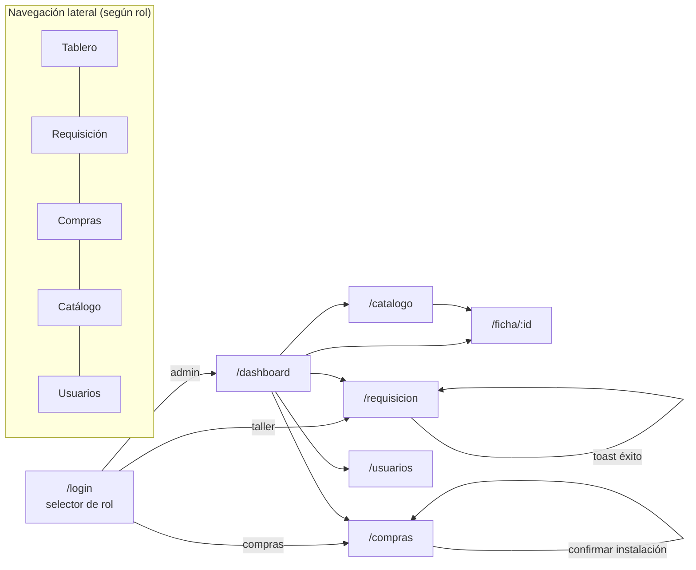

# 09 — Guía del Demo UI/UX
## Warhorse — Hub Consolidador de Gastos por Tracto

| | |
|---|---|
| **Documento** | 09 — Guía del Demo UI/UX |
| **Versión** | 2.0 |
| **Fecha** | 7 de julio de 2026 |
| **Stack del demo** | React 19 + Vite 6 + TypeScript + Tailwind CSS 4 + React Router (datos mock detrás de `lib/api.ts`) |
| **Depende de** | [01 SRS](../01-vision/01_SRS_especificacion_requisitos.md), [05 API](../05-api/05_especificacion_api.md), [08 Design System](../01-vision/08_identidad_visual_design_system.md), [ADR-003](../02-arquitectura/ADR/ADR-003_demo-first-esqueleto-reutilizable.md) |

> *v2.0: el demo ya fue **construido y validado** (`Hub Gastos Tracto - Standalone.html`). Este documento especifica su **portación al stack React 19 + Vite** como esqueleto reutilizable de `apps/web`, conservando exactamente la organización de secciones, flujos e identidad visual ya aprobados.*

---

## 1. Propósito y alcance del demo

El demo valida la experiencia completa del sistema —las 7 pantallas, la navegación por rol, los flujos Compra/Yonke y el veredicto de rentabilidad— **antes** de comprometer backend. Su criterio de éxito es el de negocio (RNF-08): un director, sin capacitación, identifica activo vs. pasivo tóxico en el Dashboard en menos de 30 segundos.

**Declaración de alcance:** el demo usa **exclusivamente datos simulados, no persiste nada y no captura PII real ni toca backend**. Toda la data pasa por `lib/mock/` detrás de la firma de `lib/api.ts` (contrato del doc [05](../05-api/05_especificacion_api.md)). Está **prohibido** cablear datos reales o llamadas a red ([ADR-003](../02-arquitectura/ADR/ADR-003_demo-first-esqueleto-reutilizable.md)).

**Fuera del demo:** autenticación real, persistencia, subida real de archivos, notificaciones reales. El "login" solo fija el rol activo; la "foto" es un placeholder de UI; el "envío" persiste solo en estado de React durante la sesión.

---

## 2. Inventario de pantallas (trazado al SRS)

| Pantalla | Requisito(s) SRS | Ruta | Rol(es) que la usan |
|---|---|---|---|
| Login (2 columnas, selector de rol) | RF-AUTH-01/02/04 | `/login` | Todos |
| Dashboard / Tablero Directivo | RF-DASH-01..06 | `/dashboard` | Dirección |
| Ficha de Tracto | RF-FIC-01..04 | `/ficha/:id` | Todos (navegable) |
| Requisición de refacciones | RF-REQ-01..07 | `/requisicion` | Taller |
| Panel de Compras | RF-COM-01..04 | `/compras` | Compras |
| Catálogo de Unidades | RF-UNI-01/04/05 | `/catalogo` | Todos |
| Usuarios y Permisos | RF-USR-01..03 | `/usuarios` | Dirección |

Cobertura: 100% de los flujos críticos del SRS. La navegación visible por rol replica la matriz de permisos del demo (`admin` ve todo; `taller` = Requisición + Catálogo; `compras` = Compras + Catálogo; `diesel` = su módulo).

---

## 3. Mapa de navegación (arquitectura de información)



Al entrar, el usuario aterriza en la vista de su rol (Taller→Requisición, Compras→Compras, Dirección→Dashboard). El tour guiado de onboarding se dispara en el primer ingreso (persistido en `localStorage`).

---

## 4. Catálogo de estados por componente

Para cada componente se implementan estos estados (los estados **vacío** y **error** son obligatorios):

| Componente | default | hover | focus | disabled | loading | empty | error |
|---|---|---|---|---|---|---|---|
| Botón | ✔ | ✔ | ✔ ring naranja | ✔ | spinner inline | — | — |
| Input/Select | ✔ | — | ✔ borde naranja | ✔ | — | placeholder | borde/mensaje naranja |
| Tabla (Compras/Catálogo/Usuarios) | ✔ | fila resaltada | fila enfocable | — | skeleton de filas | "Sin registros en esta vista" (camión de firma) | "No se pudieron cargar los datos · Reintentar" |
| KPI card | ✔ | — | — | — | skeleton | "—" cuando no hay dato | — |
| Gráfica (barras/gauge/donut) | ✔ | barra resaltada | barra enfocable | — | skeleton | "Sin datos suficientes" | mensaje + reintentar |
| Formulario requisición | ✔ | — | ✔ | envío deshabilitado si inválido | envío en curso | — | mensaje de validación específico |
| Modal confirmación | ✔ | — | trap de foco correcto | — | — | — | — |
| Toast | — | — | — | — | — | — | variante error |

Los mensajes de error de la requisición replican los del demo: "Selecciona el tracto destino.", "Describe la pieza solicitada.", "El origen Yonke obliga a registrar la unidad donante.", "Asigna un costo estimado a la pieza donada, aunque no exista factura.", "La foto de la pieza o número de serie es obligatoria."

---

## 5. Capa de datos mock

Estructura de `demo-ux/app/src/lib/`:

```
lib/
├── api.ts            ← interfaz de cliente (contrato doc 05). Firma congelada.
├── types.ts          ← tipos TS de las entidades (Unidad, Requisicion, ...)
└── mock/
    ├── index.ts      ← implementa api.ts con datos simulados + latencia
    ├── fixtures.ts   ← datos por entidad (ver §5.1)
    └── scenarios.ts  ← escenarios: lista vacía, error de red, sin permiso
```

`lib/api.ts` expone la firma que el backend implementará (una función por endpoint del doc 05): `login`, `getUnidades`, `getFicha`, `crearRequisicion`, `getColaCompras`, `avanzarEstado`, `registrarDiesel`, `registrarIngreso`, `liberarUnidad`, `getDashboard`, `setParametrosVeredicto`, `getUsuarios`, etc. En el demo, `lib/mock/index.ts` la implementa con `fixtures` + latencia simulada; en producción se sustituye por llamadas reales. **Los componentes importan `lib/api.ts`, nunca `lib/mock/` directamente.**

### 5.1 Fixtures (datos realistas, del onboarding del taller)

Los datos mock usan nombres, IDs y hechos reales del onboarding para que el demo se sienta verdadero:

- **Usuarios:** Edgar Fraga (taller), Kevin Rafael Ávila (taller), Montzay Vázquez (compras), Greisy (diesel), Dirección WarHorse (admin), Héctor Ramírez (taller).
- **Unidades:** activas (WH101, WH104, WH125, …) y Yonke donantes (WH03, WH60).
- **Reparación insignia:** WH125 — Transmisión, criticidad Crítico, 86 días en taller, liberación Total.
- **Requisiciones:** una Yonke (Turbo, donante WH03, costo estimado, Instalado) y una Compra (Balatas, Cotizado, costo por definir).
- **Regla visible:** cuando `origen = Yonke`, el costo aparece con badge "Estimado" distinto del costo facturado de Compra.

### 5.2 Escenarios (no solo el camino feliz)
`scenarios.ts` permite conmutar: lista vacía (catálogo sin unidades → estado empty con camión de firma), error de red (tablas/gráficas → estado error + reintentar), y sin permiso (un rol intenta una vista ajena → mensaje y redirección). Estos escenarios se exponen con un selector de dev para la sesión de validación.

---

## 6. Accesibilidad (WCAG 2.1 AA) — checklist

- [ ] Todas las combinaciones de color en uso pasan AA (tabla §2.4 del doc [08](../01-vision/08_identidad_visual_design_system.md)).
- [ ] Navegación completa por teclado: nav lateral, formularios, tablas clickeables, modal y tour operables sin ratón.
- [ ] Foco siempre visible (anillo `--wh-orange-focus`); sin trampas de foco (modal y tour devuelven el foco al cerrar).
- [ ] Roles/labels ARIA: gráficas con texto alternativo (el veredicto y KPIs se anuncian como texto), botones con nombre accesible, tablas con encabezados asociados.
- [ ] HTML semántico; jerarquía de encabezados válida (un H1 por vista).
- [ ] Orden de tabulación lógico (nav → contenido → acciones).
- [ ] El color no es el único portador de significado (badges llevan texto: "Yonke", "Crítica", "Instalado").
- [ ] `prefers-reduced-motion` respetado (barras/animaciones no esenciales se desactivan).

---

## 7. Responsive

Comportamiento por breakpoint (doc 08 §4):

- **Móvil (<640):** login apila (info compacta arriba, formulario abajo); nav colapsa a barra superior/hamburguesa; requisición a una columna; tablas con scroll horizontal o tarjetas apiladas. Prioridad: Requisición y Taller son de uso en piso, deben ser cómodas en teléfono.
- **Tablet (768–1024):** nav lateral visible; contenido a uno/dos paneles.
- **Escritorio (≥1024):** layout completo con nav lateral + grillas de KPIs y gráficas del Dashboard.

---

## 8. Microinteracciones

Referencia doc 08 §9: hover de botón `translateY(-1px)`; barras del dashboard `growBar 0.5s` y transición de altura 0.3s; toast ~200ms de entrada y ~3.2s de permanencia; modal con overlay. Duraciones 150–300ms, easing `ease/ease-out`.

---

## 9. Protocolo de validación con stakeholder

Guion de la sesión (≈20 min):
1. Login como Dirección → Dashboard. Preguntar: *"¿puedes decir en 30 s qué tracto conviene dar de baja?"* (mide RNF-08).
2. Clic en la barra crítica (WH125) → ficha → confirmar que la evidencia (86 días, mejoralitos, piezas) sustenta el veredicto.
3. Login como Taller → crear una requisición Yonke: confirmar que exige donante + costo + foto y que el costo se ve como estimado.
4. Login como Compras → avanzar el ciclo de una pieza hasta Instalado (confirmación).
5. Catálogo → filtrar Yonke → confirmar visibilidad de donantes.
6. Recorrer el tour de onboarding.

Se registra cada fricción, malentendido o cambio pedido.

---

## 10. Bitácora de hallazgos → cambios

| # | Hallazgo (sesión de validación) | Doc afectado | Cambio aplicado | Estado |
|---|---|---|---|---|
| — | *(demo v1 validado; hallazgos incorporados a la spec funcional v2.0: valorización en cascada, roles finales, diésel en alcance, veredicto configurable)* | SRS, ADR-002 | Incorporados en v2.0 | Cerrado |
| — | *(pendiente: registrar hallazgos de la sesión de validación de la portación React)* | — | — | Abierto |

Este es el entregable que cierra el bucle: tras la validación de la portación, el SRS ([01](../01-vision/01_SRS_especificacion_requisitos.md)) y la API ([05](../05-api/05_especificacion_api.md)) se re-sincronizan y el contrato de la API queda **congelado**.

---

## 11. Scaffold del demo (`demo-ux/app/`)

```
demo-ux/app/
├── package.json          ← React 19 + Vite 6 + TS + Tailwind 4 + React Router
├── index.html            ← carga de fuentes Barlow / Barlow Condensed
├── src/
│   ├── main.tsx          ← entry; importa styles/tokens.css
│   ├── routes.tsx        ← rutas del §2 + guardas por rol
│   ├── pages/            ← Login, Dashboard, Ficha, Requisicion, Compras, Catalogo, Usuarios
│   ├── components/       ← Boton, Input, Badge, Card, Tabla, NavLateral, Avatar,
│   │                        Gauge, DonutMantenimiento, BarrasGasto, Modal, Toast, Tour
│   ├── lib/
│   │   ├── api.ts        ← contrato (doc 05)
│   │   ├── types.ts
│   │   └── mock/         ← index.ts, fixtures.ts, scenarios.ts
│   └── styles/tokens.css ← tokens del doc 08 (Tailwind 4 @theme)
└── README.md             ← cómo correr el demo
```

Comandos: `npm install && npm run dev` (Vite). Al arrancar el backend (Sprint 0), esta carpeta se promueve a `apps/web/` y `lib/mock/` se sustituye por la implementación real de `lib/api.ts`, sin reescribir pantallas ni componentes.

---

## 12. Definición de Hecho del demo (Sprint D)

- [ ] Cada flujo crítico del SRS tiene su pantalla navegable (las 7 del §2).
- [ ] Cada componente expone default, hover, focus, disabled, loading, **empty, error**.
- [ ] Navegación completa por teclado; foco visible; sin trampas de foco.
- [ ] ARIA correcto; HTML semántico; jerarquía de encabezados válida.
- [ ] Todas las combinaciones de color pasan AA (doc 08).
- [ ] Responsive correcto en todos los breakpoints.
- [ ] La capa mock vive detrás de la firma de `lib/api.ts`; cero llamadas a backend.
- [ ] Datos mock cubren escenarios vacío, error y sin-permiso.
- [ ] `npm run typecheck` y `npm run lint` verdes; smoke E2E de rutas pasa.
- [ ] Sesión de validación realizada; bitácora hallazgos→cambios completa.
- [ ] SRS (01) y API (05) re-sincronizados; contrato de la API marcado como **congelado**.
